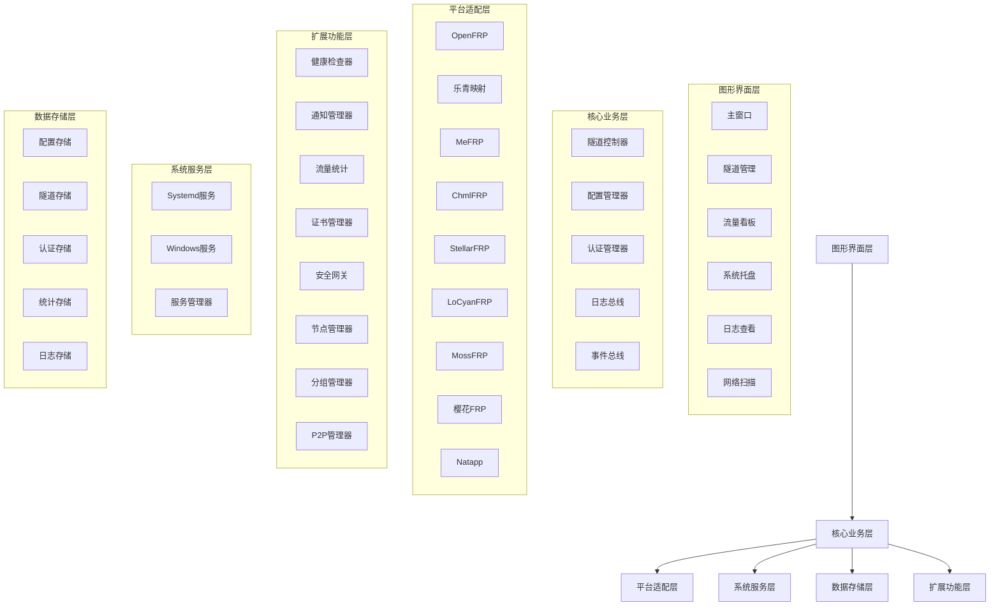
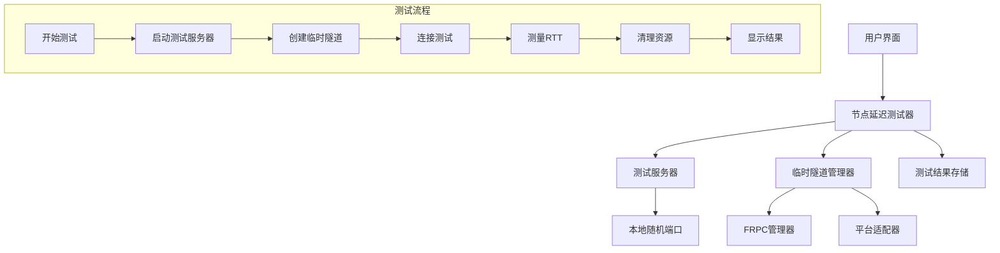

# Design Document: LinghongFrp

## Overview

LinghongFrp是一个基于Go语言开发的跨平台图形应用程序，旨在统一管理多个国内FRP服务提供商的内网穿透服务。系统采用模块化架构，通过插件式的平台适配器支持不同的FRP服务商，并提供统一的图形界面和系统服务管理功能。

### 核心特性

- **多平台支持**：统一管理OpenFRP、乐青映射、MeFRP、ChmlFRP、StellarFRP、LoCyanFRP、MossFRP、樱花FRP、Natapp等主流平台
- **跨平台GUI**：支持Windows、Linux、macOS的原生图形界面
- **系统服务**：支持作为系统服务运行，开机自启
- **智能运维**：健康检查、异常告警、自动故障转移
- **安全加固**：IP白名单、访问控制、SSL证书管理
- **高级网络**：P2P穿透、多节点负载均衡、流量统计

## Architecture

### 系统架构图



### 架构分层说明

#### 1. 图形界面层 (UI Layer)
负责用户交互和数据展示，采用Wails v2框架，使用Go后端+Vue/React前端。

#### 2. 核心业务层 (Core Business Layer)
实现核心业务逻辑，包括隧道管理、配置管理、认证管理等。

#### 3. 平台适配层 (Platform Adapter Layer)
为不同FRP服务提供商提供统一的接口适配，隔离平台差异。

#### 4. 扩展功能层 (Extended Features Layer)
提供高级功能，如健康检查、流量统计、安全防护等。

#### 5. 系统服务层 (System Service Layer)
支持将应用作为系统服务运行，实现开机自启和后台运行。

#### 6. 数据存储层 (Data Storage Layer)
负责数据持久化，支持配置、隧道、认证信息的加密存储。


## Core Components and Interfaces

### 1. 平台适配器接口 (Platform Adapter Interface)

所有平台适配器必须实现统一的接口，确保系统可以无缝切换和管理不同平台。

```go
type PlatformAdapter interface {
    // 平台基本信息
    GetPlatformName() string
    GetPlatformVersion() string
    GetAPIEndpoint() string
    
    // 认证管理
    Authenticate(credentials AuthCredentials) (*AuthToken, error)
    RefreshToken(token *AuthToken) (*AuthToken, error)
    ValidateToken(token *AuthToken) bool
    
    // 隧道管理
    CreateTunnel(config TunnelConfig) (*Tunnel, error)
    UpdateTunnel(tunnelID string, config TunnelConfig) (*Tunnel, error)
    DeleteTunnel(tunnelID string) error
    GetTunnel(tunnelID string) (*Tunnel, error)
    ListTunnels() ([]*Tunnel, error)
    
    // 隧道操作
    StartTunnel(tunnelID string) error
    StopTunnel(tunnelID string) error
    GetTunnelStatus(tunnelID string) (*TunnelStatus, error)
    
    // 平台特定功能
    GetSupportedProtocols() []string
    GetAvailableNodes() ([]*Node, error)
    GetUsageStatistics() (*UsageStats, error)
    
    // 平台特定配置
    GetRequiredCredentialFields() []CredentialField
    ValidateConfig(config TunnelConfig) error
    GetDefaultConfig() TunnelConfig
}
```

### 2. 隧道管理器 (Tunnel Manager)

统一管理所有平台的隧道，提供CRUD操作和状态监控。

```go
type TunnelController interface {
    // 隧道CRUD操作
    CreateTunnel(platformName string, config TunnelConfig) (*Tunnel, error)
    UpdateTunnel(tunnelID string, config TunnelConfig) error
    DeleteTunnel(tunnelID string) error
    
    // 隧道操作
    StartTunnel(tunnelID string) error
    StopTunnel(tunnelID string) error
    RestartTunnel(tunnelID string) error
    
    // 查询和筛选
    ListTunnels(filter TunnelFilter) ([]*Tunnel, error)
    SearchTunnels(query string) ([]*Tunnel, error)
    FilterByPlatform(platformName string) ([]*Tunnel, error)
    FilterByStatus(status TunnelStatus) ([]*Tunnel, error)
    
    // 批量操作
    BatchStart(tunnelIDs []string) (*BatchResult, error)
    BatchStop(tunnelIDs []string) (*BatchResult, error)
    BatchDelete(tunnelIDs []string) (*BatchResult, error)
}
```


### 3. 配置管理器 (Configuration Manager)

管理平台配置、应用配置和配置导入导出。

```go
type ConfigManager interface {
    // 平台配置
    AddPlatform(config PlatformConfig) error
    RemovePlatform(platformName string) error
    UpdatePlatform(platformName string, config PlatformConfig) error
    GetPlatformConfig(platformName string) (*PlatformConfig, error)
    ListPlatforms() ([]*PlatformConfig, error)
    
    // 应用配置
    GetAppConfig() (*AppConfig, error)
    UpdateAppConfig(config *AppConfig) error
    
    // 配置导入导出
    ExportConfig() ([]byte, error)
    ImportConfig(data []byte) error
    ImportFRPConfig(data []byte, format string) ([]*TunnelConfig, error) // 支持INI/TOML
    EncryptBackup(data []byte, password string) ([]byte, error)
    DecryptBackup(data []byte, password string) ([]byte, error)
}
```

### 4. 健康检查器 (Health Checker)

监控隧道和后端服务的健康状态，支持自动故障转移。

```go
type HealthChecker interface {
    // 健康检查
    CheckTunnelHealth(tunnelID string) (*HealthStatus, error)
    CheckBackendService(localIP string, localPort int) (bool, error)
    
    // 监控管理
    StartMonitoring(tunnelID string, interval time.Duration) error
    StopMonitoring(tunnelID string) error
    
    // 故障处理
    EnableAutoFailover(tunnelID string, backupNodes []*Node) error
    TriggerFailover(tunnelID string) error
}
```

### 5. 通知管理器 (Notification Manager)

支持多种通知渠道，及时告知用户隧道状态变化。

```go
type NotificationManager interface {
    // 通知发送
    SendNotification(event NotificationEvent) error
    SendBatchNotifications(events []NotificationEvent) error
    
    // 渠道管理
    RegisterChannel(channel NotificationChannel) error
    UpdateChannel(channelID string, channel NotificationChannel) error
    RemoveChannel(channelID string) error
    TestChannel(channelID string) error
    
    // 通知规则
    SetNotificationRule(rule NotificationRule) error
    GetNotificationRules() ([]*NotificationRule, error)
}
```

### 6. 流量统计器 (Traffic Statistics)

实时采集和展示流量数据，支持历史统计和可视化。

```go
type TrafficStatistics interface {
    // 数据采集
    RecordTraffic(tunnelID string, bytesIn, bytesOut int64) error
    
    // 实时统计
    GetRealtimeStats(tunnelID string) (*RealtimeStats, error)
    GetAllRealtimeStats() (map[string]*RealtimeStats, error)
    
    // 历史统计
    GetHistoricalStats(tunnelID string, period StatsPeriod) (*HistoricalStats, error)
    GetAggregatedStats(period StatsPeriod) (*AggregatedStats, error)
    
    // 数据导出
    ExportStats(tunnelID string, format string) ([]byte, error)
}
```


### 7. 证书管理器 (Certificate Manager)

自动申请和管理SSL证书，支持Let's Encrypt集成。

```go
type CertificateManager interface {
    // ACME协议集成
    RequestCertificate(domain string, email string) (*Certificate, error)
    RenewCertificate(cert *Certificate) (*Certificate, error)
    RevokeCertificate(cert *Certificate) error
    
    // 证书生命周期
    CheckExpiration(cert *Certificate) (time.Duration, error)
    AutoRenew(cert *Certificate) error
    ListCertificates() ([]*Certificate, error)
    
    // DNS验证
    ValidateDNS(domain string) (bool, error)
}
```

### 8. 安全网关 (Security Gateway)

提供访问控制、IP过滤、速率限制等安全功能。

```go
type SecurityGateway interface {
    // 访问控制
    ValidateAccess(request *AccessRequest) (bool, error)
    RecordAccess(log *AccessLog) error
    
    // IP过滤
    CheckIPWhitelist(ip string) bool
    CheckIPBlacklist(ip string) bool
    AddToBlacklist(ip string, duration time.Duration) error
    
    // 速率限制
    RateLimitCheck(ip string) (bool, error)
    
    // 安全策略
    SetSecurityPolicy(tunnelID string, policy SecurityPolicy) error
    GetSecurityPolicy(tunnelID string) (*SecurityPolicy, error)
}
```

### 9. 节点管理器 (Node Manager)

管理多个节点，支持智能切换和负载均衡。

```go
type NodeManager interface {
    // 节点管理
    AddNode(node *Node) error
    RemoveNode(nodeID string) error
    UpdateNode(nodeID string, node *Node) error
    ListNodes() ([]*Node, error)
    
    // 节点测试
    TestNode(nodeID string) (*NodeStatus, error)
    TestAllNodes() (map[string]*NodeStatus, error)
    
    // 节点选择
    SelectBestNode(nodes []*Node) (*Node, error)
    SelectNodeByStrategy(nodes []*Node, strategy LoadBalancingStrategy) (*Node, error)
    
    // 负载均衡
    EnableLoadBalancing(tunnelID string, nodes []*Node, strategy LoadBalancingStrategy) error
    DisableLoadBalancing(tunnelID string) error
}
```

### 10. P2P管理器 (P2P Manager)

管理P2P隧道，支持NAT类型检测和自动回退。

```go
type P2PManager interface {
    // NAT检测
    DetectNATType() (NATType, error)
    TestP2PCapability() (bool, error)
    GetPublicIP() (string, error)
    
    // P2P隧道管理
    CreateP2PTunnel(config P2PTunnelConfig) (*Tunnel, error)
    ConnectP2P(tunnelID string) error
    
    // 连接模式
    GetConnectionMode(tunnelID string) (string, error) // direct, relay
    ForceRelay(tunnelID string) error
}
```


### 11. 分组管理器 (Group Manager)

支持隧道分组和批量操作。

```go
type GroupManager interface {
    // 分组管理
    CreateGroup(group *TunnelGroup) error
    UpdateGroup(groupID string, group *TunnelGroup) error
    DeleteGroup(groupID string) error
    ListGroups() ([]*TunnelGroup, error)
    
    // 隧道分组
    AddTunnelToGroup(tunnelID, groupID string) error
    RemoveTunnelFromGroup(tunnelID, groupID string) error
    GetGroupTunnels(groupID string) ([]*Tunnel, error)
    
    // 批量操作
    BatchOperationOnGroup(groupID string, operation string) (*BatchResult, error)
}
```

### 12. 网络扫描器 (Network Scanner)

扫描本地网络，发现可映射的服务。

```go
type NetworkScanner interface {
    // 网络扫描
    ScanLocalNetwork() ([]*DiscoveredDevice, error)
    ScanPortRange(ip string, startPort, endPort int) ([]int, error)
    
    // 服务识别
    DetectServiceType(ip string, port int) (string, error)
    IdentifyDevice(ip string) (*DiscoveredDevice, error)
    
    // 模板应用
    ApplyTemplate(device *DiscoveredDevice, service Service) (*TunnelConfig, error)
    GetAvailableTemplates() ([]*TunnelTemplate, error)
}
```

### 13. 节点延迟测试器 (Node Latency Tester)

负责协调整个测试流程，包括服务器启动、隧道创建、连接测试和资源清理。

```go
type NodeLatencyTester interface {
    // 单节点测试
    TestNode(nodeID string, config TestConfig) (*TestResult, error)
    
    // 批量测试
    TestMultipleNodes(nodeIDs []string, config TestConfig) ([]*TestResult, error)
    
    // 取消测试
    CancelTest(testID string) error
    
    // 获取测试进度
    GetTestProgress(testID string) (*TestProgress, error)
    
    // 获取测试历史
    GetTestHistory(limit int) ([]*TestResult, error)
    
    // 推荐最佳节点
    RecommendBestNode(results []*TestResult) (*Node, error)
    
    // 清理过期测试结果
    CleanupOldResults(olderThan time.Duration) error
}
```

### 14. 测试服务器 (Test Server)

简易的TCP服务器，用于接收测试连接和数据包。

```go
type TestServer interface {
    // 启动服务器
    Start(preferredPort int) (int, error)
    
    // 停止服务器
    Stop() error
    
    // 获取服务器状态
    GetStatus() (*ServerStatus, error)
    
    // 处理测试连接
    HandleConnection(conn net.Conn) error
    
    // 获取服务器地址
    GetAddress() string
}
```

### 15. 临时隧道管理器 (Temporary Tunnel Manager)

管理测试期间创建的临时隧道，确保测试完成后正确清理。

```go
type TemporaryTunnelManager interface {
    // 创建临时隧道
    CreateTemporaryTunnel(nodeID string, localPort int) (*TemporaryTunnel, error)
    
    // 删除临时隧道
    DeleteTemporaryTunnel(tunnelID string) error
    
    // 获取临时隧道状态
    GetTunnelStatus(tunnelID string) (*TunnelStatus, error)
    
    // 等待隧道就绪
    WaitForTunnelReady(tunnelID string, timeout time.Duration) error
    
    // 清理所有临时隧道
    CleanupAllTemporaryTunnels() error
    
    // 获取远程端口
    GetRemotePort(tunnelID string) (int, error)
}
```

## Data Models

### 核心数据模型

```go
// 隧道配置
type TunnelConfig struct {
    ID           string            `json:"id"`
    Name         string            `json:"name"`
    Platform     string            `json:"platform"`
    Protocol     string            `json:"protocol"` // http, https, tcp, udp, xtcp, stcp
    LocalIP      string            `json:"local_ip"`
    LocalPort    int               `json:"local_port"`
    RemotePort   int               `json:"remote_port,omitempty"`
    CustomDomain string            `json:"custom_domain,omitempty"`
    NodeID       string            `json:"node_id,omitempty"`
    GroupID      string            `json:"group_id,omitempty"`
    Tags         []string          `json:"tags"`
    Metadata     map[string]string `json:"metadata"`
    
    // P2P配置
    P2PConfig    *P2PTunnelConfig  `json:"p2p_config,omitempty"`
    
    // 安全配置
    SecurityPolicy *SecurityPolicy `json:"security_policy,omitempty"`
    
    // SSL配置
    SSLEnabled   bool              `json:"ssl_enabled"`
    CertificateID string           `json:"certificate_id,omitempty"`
    
    CreatedAt    time.Time         `json:"created_at"`
    UpdatedAt    time.Time         `json:"updated_at"`
}

// 隧道实例
type Tunnel struct {
    Config       TunnelConfig      `json:"config"`
    Status       TunnelStatus      `json:"status"`
    Stats        TunnelStats       `json:"stats"`
    HealthStatus *HealthStatus     `json:"health_status,omitempty"`
    Error        string            `json:"error,omitempty"`
}

// 隧道状态
type TunnelStatus struct {
    State        string    `json:"state"` // stopped, starting, running, stopping, error
    PublicURL    string    `json:"public_url,omitempty"`
    ConnectedAt  time.Time `json:"connected_at,omitempty"`
    LastError    string    `json:"last_error,omitempty"`
    ConnectionMode string  `json:"connection_mode,omitempty"` // direct, relay (for P2P)
}
```


// 隧道统计
type TunnelStats struct {
    BytesIn          int64     `json:"bytes_in"`
    BytesOut         int64     `json:"bytes_out"`
    Connections      int64     `json:"connections"`
    LastActive       time.Time `json:"last_active"`
    UploadSpeed      int64     `json:"upload_speed"` // bytes/s
    DownloadSpeed    int64     `json:"download_speed"` // bytes/s
    ActiveConnections int      `json:"active_connections"`
}

// 平台配置
type PlatformConfig struct {
    Name        string            `json:"name"`
    DisplayName string            `json:"display_name"`
    Type        string            `json:"type"` // openfrp, leqing, mefrp, etc.
    APIEndpoint string            `json:"api_endpoint"`
    Credentials AuthCredentials   `json:"credentials"`
    Settings    map[string]string `json:"settings"`
    Enabled     bool              `json:"enabled"`
    Version     string            `json:"version,omitempty"`
    Features    []string          `json:"features,omitempty"`
}

// 认证凭据
type AuthCredentials struct {
    Type         string            `json:"type"` // token, username_password, api_key, oauth
    Username     string            `json:"username,omitempty"`
    Password     string            `json:"password,omitempty"`
    Token        string            `json:"token,omitempty"`
    APIKey       string            `json:"api_key,omitempty"`
    ClientID     string            `json:"client_id,omitempty"`
    ClientSecret string            `json:"client_secret,omitempty"`
    Extra        map[string]string `json:"extra,omitempty"`
}

// 节点信息
type Node struct {
    ID          string   `json:"id"`
    Name        string   `json:"name"`
    Location    string   `json:"location"`
    Country     string   `json:"country"`
    Available   bool     `json:"available"`
    Load        float64  `json:"load"`
    Latency     int      `json:"latency"` // ms
    Bandwidth   int64    `json:"bandwidth"` // bps
    Protocols   []string `json:"protocols"`
}

// 节点状态
type NodeStatus struct {
    NodeID      string    `json:"node_id"`
    Available   bool      `json:"available"`
    Latency     int       `json:"latency"` // ms
    Load        float64   `json:"load"` // 0-1
    LastCheck   time.Time `json:"last_check"`
    ErrorCount  int       `json:"error_count"`
}
```

### 扩展功能数据模型

```go
// P2P隧道配置
type P2PTunnelConfig struct {
    Mode       string   `json:"mode"` // xtcp, stcp
    SecretKey  string   `json:"secret_key"`
    AllowUsers []string `json:"allow_users,omitempty"`
    Role       string   `json:"role"` // server, visitor
    ServerName string   `json:"server_name,omitempty"`
    BindAddr   string   `json:"bind_addr,omitempty"`
    BindPort   int      `json:"bind_port,omitempty"`
}

// NAT类型
type NATType int

const (
    NATTypeFullCone NATType = iota
    NATTypeRestrictedCone
    NATTypePortRestrictedCone
    NATTypeSymmetric
    NATTypeUnknown
)
```


// SSL证书
type Certificate struct {
    ID          string    `json:"id"`
    Domain      string    `json:"domain"`
    CertPEM     []byte    `json:"cert_pem"`
    KeyPEM      []byte    `json:"key_pem"`
    IssuedAt    time.Time `json:"issued_at"`
    ExpiresAt   time.Time `json:"expires_at"`
    Issuer      string    `json:"issuer"`
    AutoRenew   bool      `json:"auto_renew"`
}

// 健康状态
type HealthStatus struct {
    TunnelID      string    `json:"tunnel_id"`
    IsHealthy     bool      `json:"is_healthy"`
    LastCheckTime time.Time `json:"last_check_time"`
    ErrorMessage  string    `json:"error_message,omitempty"`
    ResponseTime  int       `json:"response_time"` // ms
    BackendStatus string    `json:"backend_status"` // online, offline, error
}

// 通知渠道
type NotificationChannel struct {
    ID      string            `json:"id"`
    Name    string            `json:"name"`
    Type    string            `json:"type"` // serverchan, pushplus, telegram, dingtalk, wecom, email
    Config  map[string]string `json:"config"`
    Enabled bool              `json:"enabled"`
}

// 通知事件
type NotificationEvent struct {
    Type       string    `json:"type"` // tunnel_down, tunnel_up, service_error, certificate_expiring
    TunnelID   string    `json:"tunnel_id,omitempty"`
    TunnelName string    `json:"tunnel_name,omitempty"`
    Message    string    `json:"message"`
    Severity   string    `json:"severity"` // info, warning, error, critical
    Timestamp  time.Time `json:"timestamp"`
}

// 通知规则
type NotificationRule struct {
    ID          string   `json:"id"`
    Name        string   `json:"name"`
    EventTypes  []string `json:"event_types"`
    Channels    []string `json:"channel_ids"`
    TunnelIDs   []string `json:"tunnel_ids,omitempty"` // 空表示所有隧道
    Enabled     bool     `json:"enabled"`
    SilentPeriod int     `json:"silent_period"` // 静默期（秒）
}

// 实时统计
type RealtimeStats struct {
    TunnelID          string  `json:"tunnel_id"`
    UploadSpeed       int64   `json:"upload_speed"` // bytes/s
    DownloadSpeed     int64   `json:"download_speed"` // bytes/s
    ActiveConnections int     `json:"active_connections"`
    TotalBytesIn      int64   `json:"total_bytes_in"`
    TotalBytesOut     int64   `json:"total_bytes_out"`
}

// 历史统计
type HistoricalStats struct {
    TunnelID     string       `json:"tunnel_id"`
    Period       StatsPeriod  `json:"period"`
    DataPoints   []DataPoint  `json:"data_points"`
    TotalTraffic int64        `json:"total_traffic"`
}

type DataPoint struct {
    Timestamp   time.Time `json:"timestamp"`
    BytesIn     int64     `json:"bytes_in"`
    BytesOut    int64     `json:"bytes_out"`
    Connections int       `json:"connections"`
}

type StatsPeriod string

const (
    PeriodHourly  StatsPeriod = "hourly"
    PeriodDaily   StatsPeriod = "daily"
    PeriodWeekly  StatsPeriod = "weekly"
    PeriodMonthly StatsPeriod = "monthly"
)
```


// 安全策略
type SecurityPolicy struct {
    TunnelID        string          `json:"tunnel_id"`
    IPWhitelist     []string        `json:"ip_whitelist"`
    IPBlacklist     []string        `json:"ip_blacklist"`
    EnableBasicAuth bool            `json:"enable_basic_auth"`
    BasicAuthUsers  []BasicAuthUser `json:"basic_auth_users,omitempty"`
    RateLimit       *RateLimit      `json:"rate_limit,omitempty"`
    Enable2FA       bool            `json:"enable_2fa"`
}

type BasicAuthUser struct {
    Username     string `json:"username"`
    PasswordHash string `json:"password_hash"`
}

type RateLimit struct {
    RequestsPerMinute int `json:"requests_per_minute"`
    BurstSize         int `json:"burst_size"`
}

// 访问日志
type AccessLog struct {
    ID          string    `json:"id"`
    TunnelID    string    `json:"tunnel_id"`
    SourceIP    string    `json:"source_ip"`
    RequestPath string    `json:"request_path,omitempty"`
    StatusCode  int       `json:"status_code,omitempty"`
    Timestamp   time.Time `json:"timestamp"`
    Blocked     bool      `json:"blocked"`
    Reason      string    `json:"reason,omitempty"`
}

// 隧道分组
type TunnelGroup struct {
    ID          string    `json:"id"`
    Name        string    `json:"name"`
    Description string    `json:"description,omitempty"`
    Color       string    `json:"color,omitempty"`
    Icon        string    `json:"icon,omitempty"`
    TunnelIDs   []string  `json:"tunnel_ids"`
    Tags        []string  `json:"tags"`
    CreatedAt   time.Time `json:"created_at"`
}

// 批量操作结果
type BatchResult struct {
    TotalCount   int               `json:"total_count"`
    SuccessCount int               `json:"success_count"`
    FailureCount int               `json:"failure_count"`
    Results      []OperationResult `json:"results"`
}

type OperationResult struct {
    TunnelID string `json:"tunnel_id"`
    Success  bool   `json:"success"`
    Error    string `json:"error,omitempty"`
}

// 发现的设备
type DiscoveredDevice struct {
    IP        string    `json:"ip"`
    MAC       string    `json:"mac"`
    Hostname  string    `json:"hostname,omitempty"`
    OpenPorts []int     `json:"open_ports"`
    Services  []Service `json:"services"`
}

type Service struct {
    Port        int    `json:"port"`
    Protocol    string `json:"protocol"` // tcp, udp
    ServiceType string `json:"service_type"` // http, ssh, rdp, mysql, etc.
    Banner      string `json:"banner,omitempty"`
}

// 隧道模板
type TunnelTemplate struct {
    Name              string `json:"name"`
    ServiceType       string `json:"service_type"`
    Protocol          string `json:"protocol"`
    DefaultRemotePort int    `json:"default_remote_port,omitempty"`
    Description       string `json:"description"`
}

// 备份数据
type BackupData struct {
    Version    string            `json:"version"`
    ExportTime time.Time         `json:"export_time"`
    Platforms  []*PlatformConfig `json:"platforms"`
    Tunnels    []*TunnelConfig   `json:"tunnels"`
    Groups     []*TunnelGroup    `json:"groups"`
    Checksum   string            `json:"checksum"`
}

// 节点延迟测试相关数据模型

// 测试配置
type TestConfig struct {
    TestCount      int           `json:"test_count"`       // 测试次数，默认5次
    Timeout        time.Duration `json:"timeout"`          // 超时时间，默认30秒
    PacketSize     int           `json:"packet_size"`      // 数据包大小，默认1024字节
    Interval       time.Duration `json:"interval"`         // 测试间隔，默认1秒
    ConcurrentTest bool          `json:"concurrent_test"`  // 是否并发测试多个节点
}

// 测试结果
type TestResult struct {
    ID              string        `json:"id"`
    NodeID          string        `json:"node_id"`
    NodeName        string        `json:"node_name"`
    NodeLocation    string        `json:"node_location"`
    Status          string        `json:"status"` // success, failed, cancelled
    
    // 延迟统计
    MinLatency      int           `json:"min_latency"`      // 最小延迟（毫秒）
    MaxLatency      int           `json:"max_latency"`      // 最大延迟（毫秒）
    AvgLatency      int           `json:"avg_latency"`      // 平均延迟（毫秒）
    MedianLatency   int           `json:"median_latency"`   // 中位数延迟（毫秒）
    StdDevLatency   float64       `json:"stddev_latency"`   // 延迟标准差
    
    // 连接统计
    TotalTests      int           `json:"total_tests"`      // 总测试次数
    SuccessCount    int           `json:"success_count"`    // 成功次数
    FailureCount    int           `json:"failure_count"`    // 失败次数
    SuccessRate     float64       `json:"success_rate"`     // 成功率（0-100）
    PacketLoss      float64       `json:"packet_loss"`      // 丢包率（0-100）
    
    // 时间信息
    StartTime       time.Time     `json:"start_time"`
    EndTime         time.Time     `json:"end_time"`
    Duration        time.Duration `json:"duration"`
    
    // 详细数据
    LatencyData     []int         `json:"latency_data"`     // 每次测试的延迟数据
    ErrorMessage    string        `json:"error_message,omitempty"`
    
    // 测试配置
    Config          TestConfig    `json:"config"`
}

// 测试进度
type TestProgress struct {
    TestID          string        `json:"test_id"`
    NodeID          string        `json:"node_id"`
    NodeName        string        `json:"node_name"`
    Stage           string        `json:"stage"` // starting_server, creating_tunnel, testing, cleanup, completed
    StageProgress   float64       `json:"stage_progress"` // 当前阶段进度（0-100）
    TotalProgress   float64       `json:"total_progress"` // 总进度（0-100）
    CurrentTest     int           `json:"current_test"`   // 当前测试次数
    TotalTests      int           `json:"total_tests"`    // 总测试次数
    Message         string        `json:"message"`
    StartTime       time.Time     `json:"start_time"`
    ElapsedTime     time.Duration `json:"elapsed_time"`
}

// 批量测试结果
type BatchTestResult struct {
    ID              string         `json:"id"`
    Results         []*TestResult  `json:"results"`
    BestNode        *Node          `json:"best_node,omitempty"`
    StartTime       time.Time      `json:"start_time"`
    EndTime         time.Time      `json:"end_time"`
    Duration        time.Duration  `json:"duration"`
    Config          TestConfig     `json:"config"`
}

// 服务器状态
type ServerStatus struct {
    IsRunning       bool          `json:"is_running"`
    Port            int           `json:"port"`
    Address         string        `json:"address"`
    Connections     int64         `json:"connections"`
    StartTime       time.Time     `json:"start_time"`
    Uptime          time.Duration `json:"uptime"`
}

// 临时隧道
type TemporaryTunnel struct {
    ID           string         `json:"id"`
    NodeID       string         `json:"node_id"`
    LocalPort    int            `json:"local_port"`
    RemotePort   int            `json:"remote_port"`
    RemoteHost   string         `json:"remote_host"`
    ConfigPath   string         `json:"config_path"`
    ProcessID    int            `json:"process_id"`
    CreatedAt    time.Time      `json:"created_at"`
    Status       string         `json:"status"`
    CleanupFuncs []func() error `json:"-"`
}

// 测试阶段常量
const (
    StageStartingServer  = "starting_server"
    StageCreatingTunnel  = "creating_tunnel"
    StageTesting         = "testing"
    StageCleanup         = "cleanup"
    StageCompleted       = "completed"
    StageFailed          = "failed"
    StageCancelled       = "cancelled"
)

// 测试错误类型
type TestError struct {
    Type    string `json:"type"` // timeout, auth_failed, port_occupied, connection_failed, etc.
    Message string `json:"message"`
    Details string `json:"details,omitempty"`
}

const (
    ErrorTypeTimeout          = "timeout"
    ErrorTypeAuthFailed       = "auth_failed"
    ErrorTypePortOccupied     = "port_occupied"
    ErrorTypeConnectionFailed = "connection_failed"
    ErrorTypeTunnelFailed     = "tunnel_failed"
    ErrorTypeServerFailed     = "server_failed"
    ErrorTypeCancelled        = "cancelled"
)
```


## Platform-Specific Adapters

### 适配器实现策略

所有平台适配器都继承自BaseAdapter，提供统一的HTTP客户端、错误处理和重试机制。

```go
// 通用适配器基类
type BaseAdapter struct {
    platformName string
    baseURL      string
    httpClient   *http.Client
    logger       Logger
    rateLimiter  RateLimiter
}

func (b *BaseAdapter) makeRequest(method, endpoint string, body interface{}) (*http.Response, error) {
    // 通用HTTP请求处理
    // 包括认证头添加、错误处理、重试逻辑
}

func (b *BaseAdapter) handleAPIError(resp *http.Response) error {
    // 标准化错误处理
    // 将平台特定错误码映射为标准错误类型
}
```

### 支持的平台列表

| 平台 | API版本 | 认证方式 | 特殊功能 |
|------|---------|----------|----------|
| OpenFRP | v1 | 用户名/密码、远程登录、会话密钥 | 远程安全登录、主备API |
| 乐青映射 | - | API Key + 用户ID | - |
| MeFRP | - | 邮箱/密码 | 人机验证处理 |
| ChmlFRP | v2 | 用户名/密码 | Token认证 |
| StellarFRP | v1.0.1 | 用户名/密码 | 速率限制(100次/分钟) |
| LoCyanFRP | v3 | 用户名/密码 | 主备API端点 |
| MossFRP | - | 用户名/密码 | - |
| 樱花FRP | - | 用户名/密码 | - |
| Natapp | - | AuthToken | - |

### 平台适配器示例

```go
// OpenFRP适配器（增强版）
type OpenFRPAdapter struct {
    BaseAdapter
    authorization string
}

func (a *OpenFRPAdapter) GetRequiredCredentialFields() []CredentialField {
    return []CredentialField{
        {
            Name: "auth_type",
            DisplayName: "认证方式",
            Type: "select",
            Required: true,
            Options: []string{"remote_login", "session_key", "oauth"},
        },
        {Name: "username", DisplayName: "用户名", Type: "text", Required: false},
        {Name: "password", DisplayName: "密码", Type: "password", Required: false},
        {Name: "session_key", DisplayName: "会话密钥", Type: "password", Required: false},
    }
}

func (a *OpenFRPAdapter) GetAPIEndpoint() string {
    return "https://api.openfrp.net/"
}

func (a *OpenFRPAdapter) GetBackupAPIEndpoint() string {
    return "https://of-dev-api.bfsea.com/"
}

// 实现远程安全登录
func (a *OpenFRPAdapter) RequestRemoteLogin() (*RemoteLoginRequest, error) {
    // POST https://access.openfrp.net/argoAccess/requestLogin
}

func (a *OpenFRPAdapter) PollRemoteLogin(uuid string) (*AuthToken, error) {
    // GET https://access.openfrp.net/argoAccess/pollLogin
}
```


## GUI Framework and Implementation

### 框架选择：Wails v2

**选择理由**：
1. **完美的中文支持**：使用Web技术（HTML/CSS/JS），天然支持中文字体
2. **现代化UI**：可以使用Vue/React构建精美的界面
3. **Go后端集成**：无缝集成Go的系统服务和业务逻辑
4. **跨平台**：支持Windows、Linux、macOS
5. **打包简单**：生成单一可执行文件

**技术栈**：
- 后端：Go 1.21+
- 前端：Vue 3 + TypeScript + Vite
- UI组件库：Element Plus / Ant Design Vue
- 图表库：ECharts
- 状态管理：Pinia

### 界面布局设计

```
┌─────────────────────────────────────────────────────────┐
│  LinghongFrp                          [_] [□] [×]       │
├─────────────────────────────────────────────────────────┤
│ ┌─────────┐                                             │
│ │ 仪表盘  │  ┌──────────────────────────────────────┐  │
│ ├─────────┤  │                                      │  │
│ │ 隧道管理│  │         主内容区域                   │  │
│ ├─────────┤  │                                      │  │
│ │ 平台配置│  │                                      │  │
│ ├─────────┤  │                                      │  │
│ │ 流量统计│  │                                      │  │
│ ├─────────┤  │                                      │  │
│ │ 网络扫描│  │                                      │  │
│ ├─────────┤  │                                      │  │
│ │ 安全设置│  │                                      │  │
│ ├─────────┤  │                                      │  │
│ │ 通知设置│  │                                      │  │
│ ├─────────┤  │                                      │  │
│ │ 日志查看│  │                                      │  │
│ ├─────────┤  │                                      │  │
│ │ 系统设置│  │                                      │  │
│ └─────────┘  └──────────────────────────────────────┘  │
└─────────────────────────────────────────────────────────┘
```

### 主要页面功能

#### 1. 仪表盘
- 隧道总数、在线隧道、流量统计
- 实时流量图表
- 最近事件和告警
- 快速操作按钮

#### 2. 隧道管理
- 隧道列表（支持搜索、筛选、分组）
- 批量操作（启动、停止、删除）
- 隧道详情（状态、流量、日志）
- 快速创建隧道

#### 3. 平台配置
- 平台列表和状态
- 添加/编辑/删除平台
- 认证信息管理
- 平台特定设置

#### 4. 流量统计
- 实时流量监控
- 历史流量图表
- 流量排行榜
- 数据导出

#### 5. 网络扫描
- 局域网设备扫描
- 服务识别
- 一键创建映射
- 模板管理

#### 6. 安全设置
- IP白名单/黑名单
- 访问控制策略
- SSL证书管理
- 访问日志查看

#### 7. 通知设置
- 通知渠道配置
- 通知规则设置
- 测试通知
- 通知历史

#### 8. 日志查看
- 实时日志流
- 日志级别筛选
- 日志搜索
- 日志导出


## System Service Implementation

### 跨平台服务管理

```go
type ServiceManager interface {
    // 服务安装和卸载
    InstallService() error
    UninstallService() error
    
    // 服务控制
    StartService() error
    StopService() error
    RestartService() error
    
    // 服务状态
    GetServiceStatus() (*ServiceStatus, error)
    IsServiceInstalled() bool
    IsServiceRunning() bool
    
    // 服务配置
    SetServiceConfig(config ServiceConfig) error
    GetServiceConfig() (*ServiceConfig, error)
}
```

### Linux (Systemd)

```ini
[Unit]
Description=LinghongFrp Service
After=network.target

[Service]
Type=simple
User=linghongfrp
ExecStart=/usr/local/bin/linghongfrp --service
Restart=on-failure
RestartSec=5s

[Install]
WantedBy=multi-user.target
```

### Windows Service

使用`golang.org/x/sys/windows/svc`实现Windows服务。

```go
type windowsService struct {
    app *Application
}

func (s *windowsService) Execute(args []string, r <-chan svc.ChangeRequest, changes chan<- svc.Status) (bool, uint32) {
    // 实现Windows服务生命周期
}
```

## Error Handling and Recovery

### 错误分类

1. **网络错误**
   - API连接超时：指数退避重试
   - 网络不可达：离线模式
   - DNS解析失败：使用备用IP

2. **认证错误**
   - 令牌过期：自动刷新
   - 认证失败：清除凭据并提示
   - 权限不足：显示详细说明

3. **配置错误**
   - 无效配置：验证并提示
   - 配置损坏：从备份恢复
   - 端口冲突：自动检测可用端口

4. **系统错误**
   - 服务安装失败：检查权限
   - 文件系统错误：检查空间和权限
   - 内存不足：优化资源使用

### 错误恢复机制

```go
type ErrorHandler interface {
    HandleError(err error) ErrorAction
    ShouldRetry(err error) bool
    GetRetryDelay(attempt int) time.Duration
    LogError(err error, context string)
}

type ErrorAction int

const (
    ErrorActionRetry ErrorAction = iota
    ErrorActionFail
    ErrorActionIgnore
    ErrorActionPromptUser
)
```

### 重试策略

```go
// 指数退避重试
func ExponentialBackoff(attempt int) time.Duration {
    baseDelay := 1 * time.Second
    maxDelay := 60 * time.Second
    delay := baseDelay * time.Duration(math.Pow(2, float64(attempt)))
    if delay > maxDelay {
        delay = maxDelay
    }
    return delay
}
```


## Security Design

### 数据加密

#### 1. 平台认证信息加密存储

**关键原则**：所有平台的登录凭据（用户名、密码、Token、API Key等）必须加密存储，永不明文保存。

```go
type SecureCredentialStore interface {
    // 存储加密凭据
    StoreCredentials(platformName string, credentials *AuthCredentials) error
    
    // 读取并解密凭据
    LoadCredentials(platformName string) (*AuthCredentials, error)
    
    // 删除凭据
    DeleteCredentials(platformName string) error
    
    // 更新凭据
    UpdateCredentials(platformName string, credentials *AuthCredentials) error
    
    // 验证主密钥
    ValidateMasterKey(key string) bool
    
    // 更改主密钥
    ChangeMasterKey(oldKey, newKey string) error
}
```

**加密方案**：

1. **主密钥派生**
   ```go
   // 使用PBKDF2从用户密码派生主密钥
   func deriveMasterKey(password string, salt []byte) []byte {
       return pbkdf2.Key(
           []byte(password),
           salt,
           100000, // 迭代次数
           32,     // 密钥长度（AES-256）
           sha256.New,
       )
   }
   ```

2. **凭据加密**
   ```go
   // 使用AES-256-GCM加密凭据
   func encryptCredentials(plaintext []byte, masterKey []byte) ([]byte, error) {
       block, err := aes.NewCipher(masterKey)
       if err != nil {
           return nil, err
       }
       
       gcm, err := cipher.NewGCM(block)
       if err != nil {
           return nil, err
       }
       
       // 生成随机nonce
       nonce := make([]byte, gcm.NonceSize())
       if _, err := io.ReadFull(rand.Reader, nonce); err != nil {
           return nil, err
       }
       
       // 加密并附加认证标签
       ciphertext := gcm.Seal(nonce, nonce, plaintext, nil)
       return ciphertext, nil
   }
   ```

3. **存储格式**
   ```json
   {
       "version": "1",
       "salt": "base64_encoded_salt",
       "platforms": {
           "openfrp": {
               "encrypted_data": "base64_encoded_encrypted_credentials",
               "created_at": "2024-01-01T00:00:00Z",
               "updated_at": "2024-01-01T00:00:00Z"
           },
           "sakurafrp": {
               "encrypted_data": "base64_encoded_encrypted_credentials",
               "created_at": "2024-01-01T00:00:00Z",
               "updated_at": "2024-01-01T00:00:00Z"
           }
       }
   }
   ```

4. **系统密钥环集成**（可选，增强安全性）
   ```go
   // 在支持的系统上使用系统密钥环存储主密钥
   type KeyringStore interface {
       // Windows: Credential Manager
       // macOS: Keychain
       // Linux: Secret Service (libsecret)
       
       StoreKey(service, account string, key []byte) error
       LoadKey(service, account string) ([]byte, error)
       DeleteKey(service, account string) error
   }
   ```

#### 2. 配置文件加密

**敏感配置加密**：
- 使用AES-256-GCM加密敏感配置
- 密钥派生使用PBKDF2（100,000次迭代）
- 每个配置文件独立的IV（Initialization Vector）
- 添加HMAC-SHA256完整性验证

**配置文件结构**：
```json
{
    "version": "1",
    "encryption": {
        "algorithm": "AES-256-GCM",
        "kdf": "PBKDF2-SHA256",
        "iterations": 100000,
        "salt": "base64_encoded_salt"
    },
    "data": {
        "iv": "base64_encoded_iv",
        "ciphertext": "base64_encoded_encrypted_data",
        "tag": "base64_encoded_auth_tag"
    },
    "integrity": {
        "hmac": "base64_encoded_hmac_sha256"
    }
}
```

#### 3. TOML配置文件安全

**Token保护**：
```toml
# 生成的TOML配置文件中的敏感信息处理
[auth]
method = "token"
# Token从加密存储中读取，不直接写入TOML文件
# 而是在运行时注入
token = "${ENCRYPTED_TOKEN}"  # 占位符，运行时替换
```

**运行时注入**：
```go
func (m *FRPCConfigManager) GenerateSecureTOMLConfig(tunnel *Tunnel) (string, error) {
    // 1. 生成TOML配置模板
    config := m.generateConfigTemplate(tunnel)
    
    // 2. 从加密存储中读取Token
    credentials, err := m.credentialStore.LoadCredentials(tunnel.Config.Platform)
    if err != nil {
        return "", err
    }
    
    // 3. 运行时替换Token
    config.Auth.Token = credentials.Token
    
    // 4. 序列化为TOML
    tomlData, err := toml.Marshal(config)
    if err != nil {
        return "", err
    }
    
    // 5. 将TOML写入临时文件（仅在内存或安全临时目录）
    // 进程结束后自动删除
    return string(tomlData), nil
}
```

#### 4. 内存安全

**敏感数据清理**：
```go
// 使用后立即清理内存中的敏感数据
func clearSensitiveData(data []byte) {
    for i := range data {
        data[i] = 0
    }
}

// 使用defer确保清理
func processCredentials(creds *AuthCredentials) error {
    defer func() {
        if creds.Password != "" {
            clearSensitiveData([]byte(creds.Password))
        }
        if creds.Token != "" {
            clearSensitiveData([]byte(creds.Token))
        }
    }()
    
    // 处理凭据...
    return nil
}
```

#### 5. 备份文件加密

**用户控制的加密**：
- 用户提供密码
- 使用AES-256-GCM加密
- SHA-256校验和验证完整性
- 包含版本信息和元数据

**备份文件格式**：
```json
{
    "version": "1",
    "created_at": "2024-01-01T00:00:00Z",
    "encryption": {
        "algorithm": "AES-256-GCM",
        "kdf": "PBKDF2-SHA256",
        "iterations": 100000,
        "salt": "base64_encoded_salt"
    },
    "data": {
        "iv": "base64_encoded_iv",
        "ciphertext": "base64_encoded_backup_data",
        "tag": "base64_encoded_auth_tag"
    },
    "checksum": {
        "algorithm": "SHA-256",
        "value": "hex_encoded_sha256"
    }
}
```

### 访问控制

1. **IP过滤**
   - 支持CIDR格式
   - 白名单优先级高于黑名单
   - 动态黑名单（自动封禁异常IP）

2. **认证层**
   - HTTP Basic Auth
   - OAuth2（可选）
   - 双因素认证（TOTP）

3. **速率限制**
   - 令牌桶算法
   - 每IP独立限制
   - 可配置的限制策略

### 安全最佳实践

1. **首次启动**
   - 强制用户设置主密码
   - 密码强度验证（最少8位，包含大小写字母、数字、特殊字符）
   - 生成随机salt

2. **密码管理**
   - 支持密码修改
   - 密码重置需要删除所有加密数据（或提供恢复密钥）
   - 可选：支持生物识别解锁（Windows Hello / Touch ID）

3. **会话管理**
   - 主密钥在内存中缓存（可配置超时）
   - 长时间不活动自动锁定
   - 锁定后需要重新输入密码

4. **日志安全**
   - 日志中不记录敏感信息
   - Token和密码使用 `***` 替代
   - API响应中的敏感字段脱敏

5. **临时文件安全**
   - TOML配置文件存储在安全临时目录
   - 设置严格的文件权限（仅当前用户可读）
   - 进程结束后自动删除临时文件

### 审计日志

```go
type AuditLog struct {
    ID        string    `json:"id"`
    Timestamp time.Time `json:"timestamp"`
    UserID    string    `json:"user_id,omitempty"`
    Action    string    `json:"action"` // create_tunnel, delete_tunnel, login, etc.
    Resource  string    `json:"resource"`
    Result    string    `json:"result"` // success, failure
    Details   string    `json:"details,omitempty"` // 不包含敏感信息
    SourceIP  string    `json:"source_ip,omitempty"`
}

// 敏感操作审计
const (
    ActionLogin              = "login"
    ActionLogout             = "logout"
    ActionCredentialStore    = "credential_store"
    ActionCredentialLoad     = "credential_load"
    ActionCredentialDelete   = "credential_delete"
    ActionMasterKeyChange    = "master_key_change"
    ActionConfigExport       = "config_export"
    ActionConfigImport       = "config_import"
)
```

## Performance Optimization

### 性能目标

- 启动时间：< 3秒
- 内存占用：< 100MB（空闲状态）
- CPU占用：< 5%（空闲状态）
- 隧道切换时间：< 1秒
- UI响应时间：< 100ms

### 优化策略

1. **并发处理**
   - 使用goroutine池处理并发请求
   - 限制最大并发数避免资源耗尽

2. **缓存策略**
   - 节点列表缓存（5分钟）
   - 平台配置缓存
   - 统计数据聚合缓存

3. **数据库优化**
   - 使用索引加速查询
   - 定期清理过期数据
   - 批量写入减少IO

4. **网络优化**
   - HTTP连接池复用
   - 请求合并减少API调用
   - 压缩传输数据

## Testing Strategy

### 测试方法

系统采用单元测试和基于属性的测试相结合的方法：

**单元测试**：
- 验证特定示例和边界情况
- 测试集成点和组件交互
- 验证错误条件和异常处理
- 测试平台特定的功能实现

**基于属性的测试**：
- 验证跨所有输入的通用属性
- 通过随机化实现全面的输入覆盖
- 测试系统的不变量和一致性
- 验证配置的往返一致性

### 测试配置

- **最小迭代次数**：每个属性测试运行100次迭代
- **测试标记格式**：**Feature: linghongfrp, Property {number}: {property_text}**
- **测试框架**：使用Go的testing包结合property-based testing库（如gopter）

### 测试覆盖

1. **平台适配器测试**
   - 模拟API服务器
   - 测试认证流程
   - 测试隧道CRUD操作
   - 测试错误处理

2. **核心功能测试**
   - 隧道管理测试
   - 配置管理测试
   - 健康检查测试
   - 通知系统测试

3. **集成测试**
   - 端到端工作流测试
   - 跨平台兼容性测试
   - 性能压力测试
   - 安全渗透测试

4. **UI测试**
   - 组件单元测试
   - 用户交互测试
   - 响应式布局测试
   - 中文字符显示测试


## Correctness Properties

*A property is a characteristic or behavior that should hold true across all valid executions of a system-essentially, a formal statement about what the system should do. Properties serve as the bridge between human-readable specifications and machine-verifiable correctness guarantees.*

### 核心功能属性 (Properties 1-20)

#### Property 1: Platform Support Consistency
*For any* supported platform, adding the platform to the system should result in a properly configured and functional platform adapter.
**Validates: Requirements 1.1**

#### Property 2: Authentication Storage Security
*For any* platform authentication credentials, storing them should result in encrypted data that can be correctly decrypted and retrieved.
**Validates: Requirements 1.3, 2.1**

#### Property 3: Platform Adapter Interface Compliance
*For any* platform adapter, it should implement all required interface methods and handle platform-specific API formats correctly.
**Validates: Requirements 1.2, 7.1, 7.2**

#### Property 4: Authentication Method Selection
*For any* platform API call, the system should automatically use the correct authentication method for that specific platform.
**Validates: Requirements 2.2**

#### Property 5: Authentication Data Cleanup
*For any* platform configuration deletion, all related authentication information should be completely removed from storage.
**Validates: Requirements 2.4**

#### Property 6: Service Configuration Loading
*For any* system startup, all saved tunnel configurations should be automatically loaded and available for management.
**Validates: Requirements 3.3, 8.2**

#### Property 7: Graceful Service Shutdown
*For any* service stop operation, all active tunnels should be properly closed without data loss or connection errors.
**Validates: Requirements 3.4**

#### Property 8: Unified Tunnel Display
*For any* tunnel management page view, all tunnels from all platforms should be displayed in a unified table with proper platform tags.
**Validates: Requirements 4.1, 4.2**

#### Property 9: Tunnel Search Functionality
*For any* search query on tunnel names, the system should return all tunnels whose names contain the search text.
**Validates: Requirements 4.3**

#### Property 10: Platform Tag Filtering
*For any* platform tag filter, the system should return only tunnels belonging to the specified platform.
**Validates: Requirements 4.4**

#### Property 11: Real-time Status Updates
*For any* tunnel status change, the user interface should reflect the new status immediately without manual refresh.
**Validates: Requirements 4.5**

#### Property 12: Protocol Type Support
*For any* tunnel creation, the system should support all specified protocol types (HTTP, HTTPS, TCP, UDP, XTCP, STCP) for compatible platforms.
**Validates: Requirements 5.1, 9.1**

#### Property 13: Configuration Validation
*For any* tunnel configuration edit, invalid configurations should be rejected with appropriate error messages.
**Validates: Requirements 5.2**

#### Property 14: Tunnel State Management
*For any* tunnel start/stop operation, the system should correctly update the tunnel state and call the appropriate platform API.
**Validates: Requirements 5.3, 5.4**

#### Property 15: Configuration Persistence
*For any* configuration change, the data should be immediately saved and persist across application restarts.
**Validates: Requirements 5.5, 8.1**

#### Property 16: Real-time Log Display
*For any* log entry generated by the system, it should appear in the log viewer in real-time.
**Validates: Requirements 6.4**

#### Property 17: API Error Handling
*For any* platform API call failure, the system should provide detailed error information and implement appropriate retry mechanisms.
**Validates: Requirements 7.3**

#### Property 18: Configuration Import/Export Round-trip
*For any* valid configuration, exporting then importing should produce an equivalent configuration.
**Validates: Requirements 8.4, 13.1**

#### Property 19: Chinese Font Rendering
*For any* Chinese text displayed in the GUI, all characters should be rendered correctly without displaying as boxes or garbled text.
**Validates: Requirements 6.5**

#### Property 20: Cross-platform Font Consistency
*For any* GUI text on Windows, Linux, or macOS, the Chinese characters should display consistently using appropriate system fonts or embedded fonts.
**Validates: Requirements 6.1, 6.5, 6.6**


### 扩展功能属性 (Properties 21-30)

#### Property 21: P2P Connection Fallback
*For any* P2P tunnel connection attempt, if direct connection fails, the system should automatically fallback to relay mode without user intervention.
**Validates: Requirements 9.4**

#### Property 22: Certificate Auto-Renewal
*For any* SSL certificate managed by the system, renewal should be attempted automatically before expiration without service interruption.
**Validates: Requirements 10.3**

#### Property 23: Health Check Notification Reliability
*For any* tunnel health status change, notifications should be sent to all configured channels within 30 seconds.
**Validates: Requirements 11.2, 11.6**

#### Property 24: Traffic Statistics Accuracy
*For any* traffic measurement, the recorded data should match the actual bytes transferred with less than 1% error margin.
**Validates: Requirements 12.1, 12.2**

#### Property 25: Configuration Import Idempotency
*For any* valid FRP configuration file, importing it multiple times should produce the same result as importing once.
**Validates: Requirements 13.1, 13.2**

#### Property 26: Network Scan Safety
*For any* network scanning operation, the system should not cause network disruption or trigger security alerts.
**Validates: Requirements 14.1**

#### Property 27: Security Policy Enforcement
*For any* access request to a protected tunnel, the security policy should be enforced before allowing access.
**Validates: Requirements 15.1, 15.2, 15.3**

#### Property 28: Node Failover Transparency
*For any* node failure, the system should switch to a backup node without dropping active connections.
**Validates: Requirements 16.2**

#### Property 29: Batch Operation Atomicity
*For any* batch operation, either all operations should succeed or all should be rolled back to maintain consistency.
**Validates: Requirements 17.2, 17.3**

#### Property 30: Group Configuration Consistency
*For any* tunnel group, all tunnels in the group should maintain consistent configuration when batch updates are applied.
**Validates: Requirements 17.3**

### FRP客户端管理属性 (Properties 31-34)

#### Property 31: FRP Client Version Management
*For any* frpc version installation or uninstallation, the system should correctly update the version list and prevent deletion of versions currently in use by active tunnels.
**Validates: Requirements 18.2, 18.5, 18.6**

#### Property 32: FRP Client Download Integrity
*For any* frpc binary download, the system should verify the file integrity using SHA256 checksum before installation.
**Validates: Requirements 18.3, 18.4**

#### Property 33: Download Source Failover
*For any* download source failure, the system should automatically switch to the next available source without user intervention.
**Validates: Requirements 19.1, 19.5**

#### Property 34: Manual Import Validation
*For any* manually imported frpc binary, the system should validate the version, architecture compatibility, and executable permissions before accepting it.
**Validates: Requirements 19.2, 19.3**

### 安全和加密属性 (Properties 35-37)

#### Property 35: Credential Encryption Security
*For any* platform credentials stored, the encrypted data should not be decryptable without the correct master password, and decryption should produce the original credentials exactly.
**Validates: Requirements 20.3, 20.5**

#### Property 36: Master Key Derivation Consistency
*For any* master password and salt combination, the derived encryption key should be deterministic and consistent across multiple derivations.
**Validates: Requirements 20.4**

#### Property 37: Secure Memory Cleanup
*For any* sensitive data (passwords, tokens) loaded into memory, the data should be securely cleared (overwritten with zeros) after use.
**Validates: Requirements 20.10**

### 节点延迟测试属性 (Properties 38-50)

#### Property 38: Test Server Startup
*For any* node test initiation, a TCP test server should be successfully started on an available port.
**Validates: Requirements 21.1, 21.11**

#### Property 39: Temporary Tunnel Creation
*For any* test server startup, a temporary TCP tunnel should be automatically created pointing to the test server's port.
**Validates: Requirements 21.2**

#### Property 40: Connection Round-trip
*For any* established temporary tunnel, connecting through the remote port should successfully reach the local test server.
**Validates: Requirements 21.3**

#### Property 41: RTT Measurement
*For any* successful connection through the tunnel, RTT measurement should be performed and return a valid positive value.
**Validates: Requirements 21.4**

#### Property 42: Test Result Completeness
*For any* completed test, the result should contain all required metrics: latency, packet loss rate, and success rate.
**Validates: Requirements 21.5**

#### Property 43: Resource Cleanup
*For any* test completion (success, failure, or cancellation), all temporary resources (tunnel, server, config files) should be automatically cleaned up.
**Validates: Requirements 21.6, 21.12**

#### Property 44: Batch Test Concurrency
*For any* batch test with concurrent mode enabled, multiple node tests should execute in parallel and produce independent results.
**Validates: Requirements 21.7**

#### Property 45: Error Reporting
*For any* test failure, the system should provide a detailed error message indicating the specific failure type (timeout, auth failure, port occupied, etc.).
**Validates: Requirements 21.8**

#### Property 46: Result Persistence
*For any* test execution, the result should be saved to storage and retrievable through test history queries.
**Validates: Requirements 21.9**

#### Property 47: Progress Reporting
*For any* test execution, progress updates should be emitted for all major stages (starting server, creating tunnel, testing, cleanup).
**Validates: Requirements 21.10**

#### Property 48: Port Retry on Failure
*For any* test server startup failure due to port conflict, the system should automatically attempt to start on alternative available ports.
**Validates: Requirements 21.11**

#### Property 49: Best Node Recommendation
*For any* batch test completion with multiple successful results, the recommended node should be the one with the lowest average latency among nodes with success rate >= 80%.
**Validates: Requirements 21.13**

#### Property 50: Test Configuration Application
*For any* test execution with custom configuration, the specified parameters (test count, timeout, packet size) should be correctly applied during the test.
**Validates: Requirements 21.14**

## Node Latency Testing (Requirement 21)

### 概述

节点延迟测试功能允许用户测试不同FRP节点的延迟和连通性，帮助用户选择最快最稳定的节点。系统通过在本地启动临时TCP测试服务器，创建临时隧道，然后通过远程端口连接回本地服务器来测量往返时间（RTT）。测试完成后，系统自动清理所有临时资源。

### 架构设计



### 14. 节点延迟测试器 (Node Latency Tester)

负责协调整个测试流程，包括服务器启动、隧道创建、连接测试和资源清理。

```go
type NodeLatencyTester interface {
    // 单节点测试
    TestNode(nodeID string, config TestConfig) (*TestResult, error)
    
    // 批量测试
    TestMultipleNodes(nodeIDs []string, config TestConfig) ([]*TestResult, error)
    
    // 取消测试
    CancelTest(testID string) error
    
    // 获取测试进度
    GetTestProgress(testID string) (*TestProgress, error)
    
    // 获取测试历史
    GetTestHistory(limit int) ([]*TestResult, error)
    
    // 推荐最佳节点
    RecommendBestNode(results []*TestResult) (*Node, error)
    
    // 清理过期测试结果
    CleanupOldResults(olderThan time.Duration) error
}
```

### 15. 测试服务器 (Test Server)

简易的TCP服务器，用于接收测试连接和数据包。

```go
type TestServer interface {
    // 启动服务器
    Start(preferredPort int) (int, error)
    
    // 停止服务器
    Stop() error
    
    // 获取服务器状态
    GetStatus() (*ServerStatus, error)
    
    // 处理测试连接
    HandleConnection(conn net.Conn) error
    
    // 获取服务器地址
    GetAddress() string
}

type TestServerImpl struct {
    listener    net.Listener
    port        int
    isRunning   bool
    connections int64
    startTime   time.Time
    mu          sync.RWMutex
}

func (s *TestServerImpl) Start(preferredPort int) (int, error) {
    s.mu.Lock()
    defer s.mu.Unlock()
    
    if s.isRunning {
        return 0, errors.New("server already running")
    }
    
    // 尝试首选端口
    port := preferredPort
    if port == 0 {
        port = s.findAvailablePort()
    }
    
    // 尝试启动服务器，如果失败则尝试其他端口
    maxRetries := 10
    for i := 0; i < maxRetries; i++ {
        addr := fmt.Sprintf("127.0.0.1:%d", port)
        listener, err := net.Listen("tcp", addr)
        if err == nil {
            s.listener = listener
            s.port = port
            s.isRunning = true
            s.startTime = time.Now()
            
            // 启动连接处理goroutine
            go s.acceptConnections()
            
            return port, nil
        }
        
        // 端口被占用，尝试下一个
        port = s.findAvailablePort()
    }
    
    return 0, errors.New("failed to find available port after retries")
}

func (s *TestServerImpl) acceptConnections() {
    for s.isRunning {
        conn, err := s.listener.Accept()
        if err != nil {
            if s.isRunning {
                log.Errorf("Accept error: %v", err)
            }
            continue
        }
        
        atomic.AddInt64(&s.connections, 1)
        go s.HandleConnection(conn)
    }
}

func (s *TestServerImpl) HandleConnection(conn net.Conn) error {
    defer conn.Close()
    defer atomic.AddInt64(&s.connections, -1)
    
    // 设置超时
    conn.SetDeadline(time.Now().Add(30 * time.Second))
    
    // 读取测试数据包
    buffer := make([]byte, 4096)
    n, err := conn.Read(buffer)
    if err != nil {
        return err
    }
    
    // 回显数据包（echo）
    _, err = conn.Write(buffer[:n])
    return err
}

func (s *TestServerImpl) findAvailablePort() int {
    // 在动态端口范围内随机选择
    return 10000 + rand.Intn(55000)
}
```

### 16. 临时隧道管理器 (Temporary Tunnel Manager)

管理测试期间创建的临时隧道，确保测试完成后正确清理。

```go
type TemporaryTunnelManager interface {
    // 创建临时隧道
    CreateTemporaryTunnel(nodeID string, localPort int) (*TemporaryTunnel, error)
    
    // 删除临时隧道
    DeleteTemporaryTunnel(tunnelID string) error
    
    // 获取临时隧道状态
    GetTunnelStatus(tunnelID string) (*TunnelStatus, error)
    
    // 等待隧道就绪
    WaitForTunnelReady(tunnelID string, timeout time.Duration) error
    
    // 清理所有临时隧道
    CleanupAllTemporaryTunnels() error
    
    // 获取远程端口
    GetRemotePort(tunnelID string) (int, error)
}

type TemporaryTunnel struct {
    ID           string
    NodeID       string
    LocalPort    int
    RemotePort   int
    ConfigPath   string
    ProcessID    int
    CreatedAt    time.Time
    Status       string
    CleanupFuncs []func() error
}

func (m *TemporaryTunnelManager) CreateTemporaryTunnel(nodeID string, localPort int) (*TemporaryTunnel, error) {
    // 1. 生成唯一ID
    tunnelID := fmt.Sprintf("test-%s-%d", nodeID, time.Now().Unix())
    
    // 2. 获取节点信息
    node, err := m.nodeManager.GetNode(nodeID)
    if err != nil {
        return nil, err
    }
    
    // 3. 生成临时TOML配置
    config := &FRPCConfig{
        ServerAddr: node.ServerAddr,
        ServerPort: node.ServerPort,
        Auth: AuthConfig{
            Method: "token",
            Token:  node.Token,
        },
        Proxies: []ProxyConfig{
            {
                Name:      tunnelID,
                Type:      "tcp",
                LocalIP:   "127.0.0.1",
                LocalPort: localPort,
                RemotePort: 0, // 让服务器分配
            },
        },
    }
    
    // 4. 保存临时配置文件
    configPath := filepath.Join(m.tempDir, fmt.Sprintf("%s.toml", tunnelID))
    if err := m.saveTOMLConfig(config, configPath); err != nil {
        return nil, err
    }
    
    // 5. 启动frpc进程
    process, err := m.frpcManager.StartTunnel(tunnelID, configPath)
    if err != nil {
        os.Remove(configPath)
        return nil, err
    }
    
    // 6. 创建临时隧道对象
    tunnel := &TemporaryTunnel{
        ID:         tunnelID,
        NodeID:     nodeID,
        LocalPort:  localPort,
        ConfigPath: configPath,
        ProcessID:  process.PID,
        CreatedAt:  time.Now(),
        Status:     "starting",
        CleanupFuncs: []func() error{
            func() error { return m.frpcManager.StopTunnel(tunnelID) },
            func() error { return os.Remove(configPath) },
        },
    }
    
    // 7. 等待隧道建立并获取远程端口
    if err := m.WaitForTunnelReady(tunnelID, 30*time.Second); err != nil {
        m.cleanup(tunnel)
        return nil, err
    }
    
    // 8. 从日志或API获取分配的远程端口
    remotePort, err := m.getAssignedRemotePort(tunnelID)
    if err != nil {
        m.cleanup(tunnel)
        return nil, err
    }
    tunnel.RemotePort = remotePort
    tunnel.Status = "ready"
    
    // 9. 注册临时隧道
    m.mu.Lock()
    m.tunnels[tunnelID] = tunnel
    m.mu.Unlock()
    
    return tunnel, nil
}

func (m *TemporaryTunnelManager) cleanup(tunnel *TemporaryTunnel) error {
    var errs []error
    for _, cleanupFunc := range tunnel.CleanupFuncs {
        if err := cleanupFunc(); err != nil {
            errs = append(errs, err)
        }
    }
    
    if len(errs) > 0 {
        return fmt.Errorf("cleanup errors: %v", errs)
    }
    return nil
}
```

### 测试数据模型

```go
// 测试配置
type TestConfig struct {
    TestCount      int           `json:"test_count"`       // 测试次数，默认5次
    Timeout        time.Duration `json:"timeout"`          // 超时时间，默认30秒
    PacketSize     int           `json:"packet_size"`      // 数据包大小，默认1024字节
    Interval       time.Duration `json:"interval"`         // 测试间隔，默认1秒
    ConcurrentTest bool          `json:"concurrent_test"`  // 是否并发测试多个节点
}

// 测试结果
type TestResult struct {
    ID              string        `json:"id"`
    NodeID          string        `json:"node_id"`
    NodeName        string        `json:"node_name"`
    NodeLocation    string        `json:"node_location"`
    Status          string        `json:"status"` // success, failed, cancelled
    
    // 延迟统计
    MinLatency      int           `json:"min_latency"`      // 最小延迟（毫秒）
    MaxLatency      int           `json:"max_latency"`      // 最大延迟（毫秒）
    AvgLatency      int           `json:"avg_latency"`      // 平均延迟（毫秒）
    MedianLatency   int           `json:"median_latency"`   // 中位数延迟（毫秒）
    StdDevLatency   float64       `json:"stddev_latency"`   // 延迟标准差
    
    // 连接统计
    TotalTests      int           `json:"total_tests"`      // 总测试次数
    SuccessCount    int           `json:"success_count"`    // 成功次数
    FailureCount    int           `json:"failure_count"`    // 失败次数
    SuccessRate     float64       `json:"success_rate"`     // 成功率（0-100）
    PacketLoss      float64       `json:"packet_loss"`      // 丢包率（0-100）
    
    // 时间信息
    StartTime       time.Time     `json:"start_time"`
    EndTime         time.Time     `json:"end_time"`
    Duration        time.Duration `json:"duration"`
    
    // 详细数据
    LatencyData     []int         `json:"latency_data"`     // 每次测试的延迟数据
    ErrorMessage    string        `json:"error_message,omitempty"`
    
    // 测试配置
    Config          TestConfig    `json:"config"`
}

// 测试进度
type TestProgress struct {
    TestID          string        `json:"test_id"`
    NodeID          string        `json:"node_id"`
    NodeName        string        `json:"node_name"`
    Stage           string        `json:"stage"` // starting_server, creating_tunnel, testing, cleanup, completed
    StageProgress   float64       `json:"stage_progress"` // 当前阶段进度（0-100）
    TotalProgress   float64       `json:"total_progress"` // 总进度（0-100）
    CurrentTest     int           `json:"current_test"`   // 当前测试次数
    TotalTests      int           `json:"total_tests"`    // 总测试次数
    Message         string        `json:"message"`
    StartTime       time.Time     `json:"start_time"`
    ElapsedTime     time.Duration `json:"elapsed_time"`
}

// 批量测试结果
type BatchTestResult struct {
    ID              string         `json:"id"`
    Results         []*TestResult  `json:"results"`
    BestNode        *Node          `json:"best_node,omitempty"`
    StartTime       time.Time      `json:"start_time"`
    EndTime         time.Time      `json:"end_time"`
    Duration        time.Duration  `json:"duration"`
    Config          TestConfig     `json:"config"`
}

// 服务器状态
type ServerStatus struct {
    IsRunning       bool          `json:"is_running"`
    Port            int           `json:"port"`
    Address         string        `json:"address"`
    Connections     int64         `json:"connections"`
    StartTime       time.Time     `json:"start_time"`
    Uptime          time.Duration `json:"uptime"`
}

// 测试阶段
const (
    StageStartingServer  = "starting_server"
    StageCreatingTunnel  = "creating_tunnel"
    StageTesting         = "testing"
    StageCleanup         = "cleanup"
    StageCompleted       = "completed"
    StageFailed          = "failed"
    StageCancelled       = "cancelled"
)

// 测试错误类型
type TestError struct {
    Type    string `json:"type"` // timeout, auth_failed, port_occupied, connection_failed, etc.
    Message string `json:"message"`
    Details string `json:"details,omitempty"`
}

const (
    ErrorTypeTimeout          = "timeout"
    ErrorTypeAuthFailed       = "auth_failed"
    ErrorTypePortOccupied     = "port_occupied"
    ErrorTypeConnectionFailed = "connection_failed"
    ErrorTypeTunnelFailed     = "tunnel_failed"
    ErrorTypeServerFailed     = "server_failed"
    ErrorTypeCancelled        = "cancelled"
)
```

### 测试流程详细说明

#### 单节点测试流程

```go
func (t *NodeLatencyTester) TestNode(nodeID string, config TestConfig) (*TestResult, error) {
    // 1. 创建测试ID和结果对象
    testID := generateTestID()
    result := &TestResult{
        ID:         testID,
        NodeID:     nodeID,
        StartTime:  time.Now(),
        Config:     config,
        Status:     "running",
    }
    
    // 2. 更新进度：启动测试服务器
    t.updateProgress(testID, &TestProgress{
        TestID:     testID,
        NodeID:     nodeID,
        Stage:      StageStartingServer,
        Message:    "正在启动测试服务器...",
        StartTime:  time.Now(),
    })
    
    // 3. 启动测试服务器
    server := NewTestServer()
    port, err := server.Start(0) // 使用随机端口
    if err != nil {
        return t.handleTestError(result, ErrorTypeServerFailed, err)
    }
    defer server.Stop()
    
    // 4. 更新进度：创建临时隧道
    t.updateProgress(testID, &TestProgress{
        TestID:     testID,
        NodeID:     nodeID,
        Stage:      StageCreatingTunnel,
        Message:    fmt.Sprintf("正在创建临时隧道（本地端口：%d）...", port),
    })
    
    // 5. 创建临时隧道
    tunnel, err := t.tunnelManager.CreateTemporaryTunnel(nodeID, port)
    if err != nil {
        return t.handleTestError(result, ErrorTypeTunnelFailed, err)
    }
    defer t.tunnelManager.DeleteTemporaryTunnel(tunnel.ID)
    
    // 6. 等待隧道就绪
    if err := t.tunnelManager.WaitForTunnelReady(tunnel.ID, config.Timeout); err != nil {
        return t.handleTestError(result, ErrorTypeTimeout, err)
    }
    
    // 7. 获取远程端口
    remotePort := tunnel.RemotePort
    remoteAddr := fmt.Sprintf("%s:%d", tunnel.RemoteHost, remotePort)
    
    // 8. 更新进度：开始测试
    t.updateProgress(testID, &TestProgress{
        TestID:      testID,
        NodeID:      nodeID,
        Stage:       StageTesting,
        TotalTests:  config.TestCount,
        Message:     fmt.Sprintf("正在测试连接（远程地址：%s）...", remoteAddr),
    })
    
    // 9. 执行多次测试
    var latencies []int
    successCount := 0
    
    for i := 0; i < config.TestCount; i++ {
        // 检查是否取消
        if t.isCancelled(testID) {
            return t.handleTestError(result, ErrorTypeCancelled, errors.New("test cancelled by user"))
        }
        
        // 更新当前测试进度
        t.updateProgress(testID, &TestProgress{
            TestID:      testID,
            NodeID:      nodeID,
            Stage:       StageTesting,
            CurrentTest: i + 1,
            TotalTests:  config.TestCount,
            Message:     fmt.Sprintf("正在进行第 %d/%d 次测试...", i+1, config.TestCount),
        })
        
        // 执行单次测试
        latency, err := t.performSingleTest(remoteAddr, config)
        if err == nil {
            latencies = append(latencies, latency)
            successCount++
        }
        
        // 测试间隔
        if i < config.TestCount-1 {
            time.Sleep(config.Interval)
        }
    }
    
    // 10. 更新进度：清理资源
    t.updateProgress(testID, &TestProgress{
        TestID:  testID,
        NodeID:  nodeID,
        Stage:   StageCleanup,
        Message: "正在清理临时资源...",
    })
    
    // 11. 计算统计数据
    result.EndTime = time.Now()
    result.Duration = result.EndTime.Sub(result.StartTime)
    result.TotalTests = config.TestCount
    result.SuccessCount = successCount
    result.FailureCount = config.TestCount - successCount
    result.SuccessRate = float64(successCount) / float64(config.TestCount) * 100
    result.PacketLoss = float64(result.FailureCount) / float64(config.TestCount) * 100
    result.LatencyData = latencies
    
    if len(latencies) > 0 {
        result.MinLatency = minInt(latencies)
        result.MaxLatency = maxInt(latencies)
        result.AvgLatency = avgInt(latencies)
        result.MedianLatency = medianInt(latencies)
        result.StdDevLatency = stdDevInt(latencies)
    }
    
    result.Status = "success"
    
    // 12. 保存测试结果
    if err := t.resultStore.SaveResult(result); err != nil {
        log.Errorf("Failed to save test result: %v", err)
    }
    
    // 13. 更新进度：完成
    t.updateProgress(testID, &TestProgress{
        TestID:        testID,
        NodeID:        nodeID,
        Stage:         StageCompleted,
        TotalProgress: 100,
        Message:       "测试完成",
    })
    
    return result, nil
}

func (t *NodeLatencyTester) performSingleTest(remoteAddr string, config TestConfig) (int, error) {
    startTime := time.Now()
    
    // 1. 连接到远程端口
    conn, err := net.DialTimeout("tcp", remoteAddr, config.Timeout)
    if err != nil {
        return 0, err
    }
    defer conn.Close()
    
    // 2. 设置超时
    conn.SetDeadline(time.Now().Add(config.Timeout))
    
    // 3. 生成测试数据包
    testData := make([]byte, config.PacketSize)
    rand.Read(testData)
    
    // 4. 发送数据包
    _, err = conn.Write(testData)
    if err != nil {
        return 0, err
    }
    
    // 5. 接收回显数据
    buffer := make([]byte, config.PacketSize)
    _, err = io.ReadFull(conn, buffer)
    if err != nil {
        return 0, err
    }
    
    // 6. 计算往返时间
    latency := int(time.Since(startTime).Milliseconds())
    
    return latency, nil
}
```

#### 批量测试流程

```go
func (t *NodeLatencyTester) TestMultipleNodes(nodeIDs []string, config TestConfig) ([]*TestResult, error) {
    batchID := generateBatchID()
    results := make([]*TestResult, 0, len(nodeIDs))
    
    if config.ConcurrentTest {
        // 并发测试
        var wg sync.WaitGroup
        resultChan := make(chan *TestResult, len(nodeIDs))
        
        for _, nodeID := range nodeIDs {
            wg.Add(1)
            go func(nid string) {
                defer wg.Done()
                result, err := t.TestNode(nid, config)
                if err != nil {
                    log.Errorf("Test failed for node %s: %v", nid, err)
                    result = &TestResult{
                        NodeID:       nid,
                        Status:       "failed",
                        ErrorMessage: err.Error(),
                    }
                }
                resultChan <- result
            }(nodeID)
        }
        
        wg.Wait()
        close(resultChan)
        
        for result := range resultChan {
            results = append(results, result)
        }
    } else {
        // 顺序测试
        for _, nodeID := range nodeIDs {
            result, err := t.TestNode(nodeID, config)
            if err != nil {
                log.Errorf("Test failed for node %s: %v", nodeID, err)
                result = &TestResult{
                    NodeID:       nodeID,
                    Status:       "failed",
                    ErrorMessage: err.Error(),
                }
            }
            results = append(results, result)
        }
    }
    
    // 保存批量测试结果
    batchResult := &BatchTestResult{
        ID:        batchID,
        Results:   results,
        StartTime: time.Now(),
        EndTime:   time.Now(),
        Config:    config,
    }
    
    // 推荐最佳节点
    if bestNode, err := t.RecommendBestNode(results); err == nil {
        batchResult.BestNode = bestNode
    }
    
    return results, nil
}
```

### 错误处理和资源清理机制

```go
// 错误处理
func (t *NodeLatencyTester) handleTestError(result *TestResult, errorType string, err error) (*TestResult, error) {
    result.Status = "failed"
    result.EndTime = time.Now()
    result.Duration = result.EndTime.Sub(result.StartTime)
    result.ErrorMessage = fmt.Sprintf("[%s] %s", errorType, err.Error())
    
    // 保存失败结果
    t.resultStore.SaveResult(result)
    
    return result, &TestError{
        Type:    errorType,
        Message: err.Error(),
    }
}

// 资源清理
type ResourceCleaner struct {
    cleanupFuncs []func() error
    mu           sync.Mutex
}

func (rc *ResourceCleaner) Register(cleanup func() error) {
    rc.mu.Lock()
    defer rc.mu.Unlock()
    rc.cleanupFuncs = append(rc.cleanupFuncs, cleanup)
}

func (rc *ResourceCleaner) Cleanup() error {
    rc.mu.Lock()
    defer rc.mu.Unlock()
    
    var errs []error
    // 逆序清理
    for i := len(rc.cleanupFuncs) - 1; i >= 0; i-- {
        if err := rc.cleanupFuncs[i](); err != nil {
            errs = append(errs, err)
        }
    }
    
    if len(errs) > 0 {
        return fmt.Errorf("cleanup errors: %v", errs)
    }
    return nil
}

// 测试取消处理
func (t *NodeLatencyTester) CancelTest(testID string) error {
    t.mu.Lock()
    defer t.mu.Unlock()
    
    // 标记为取消
    t.cancelledTests[testID] = true
    
    // 触发取消信号
    if cancel, exists := t.cancelFuncs[testID]; exists {
        cancel()
        delete(t.cancelFuncs, testID)
    }
    
    // 更新进度
    t.updateProgress(testID, &TestProgress{
        Stage:   StageCancelled,
        Message: "测试已取消",
    })
    
    return nil
}

// 超时处理
func (t *NodeLatencyTester) withTimeout(ctx context.Context, timeout time.Duration, fn func() error) error {
    ctx, cancel := context.WithTimeout(ctx, timeout)
    defer cancel()
    
    errChan := make(chan error, 1)
    go func() {
        errChan <- fn()
    }()
    
    select {
    case err := <-errChan:
        return err
    case <-ctx.Done():
        return fmt.Errorf("operation timeout after %v", timeout)
    }
}
```

### 最佳节点推荐算法

```go
func (t *NodeLatencyTester) RecommendBestNode(results []*TestResult) (*Node, error) {
    if len(results) == 0 {
        return nil, errors.New("no test results available")
    }
    
    // 过滤成功的测试结果
    successResults := make([]*TestResult, 0)
    for _, result := range results {
        if result.Status == "success" && result.SuccessRate >= 80 {
            successResults = append(successResults, result)
        }
    }
    
    if len(successResults) == 0 {
        return nil, errors.New("no successful test results")
    }
    
    // 计算综合得分
    type nodeScore struct {
        nodeID string
        score  float64
    }
    
    scores := make([]nodeScore, 0, len(successResults))
    for _, result := range successResults {
        // 综合得分 = 延迟权重 * (1 / 平均延迟) + 成功率权重 * 成功率 + 稳定性权重 * (1 / 标准差)
        latencyScore := 1000.0 / float64(result.AvgLatency)
        successRateScore := result.SuccessRate / 100.0
        stabilityScore := 100.0 / (result.StdDevLatency + 1.0)
        
        // 权重：延迟50%，成功率30%，稳定性20%
        totalScore := latencyScore*0.5 + successRateScore*0.3 + stabilityScore*0.2
        
        scores = append(scores, nodeScore{
            nodeID: result.NodeID,
            score:  totalScore,
        })
    }
    
    // 按得分排序
    sort.Slice(scores, func(i, j int) bool {
        return scores[i].score > scores[j].score
    })
    
    // 返回最佳节点
    bestNodeID := scores[0].nodeID
    return t.nodeManager.GetNode(bestNodeID)
}
```

### 测试结果可视化数据

```go
// 图表数据
type ChartData struct {
    Labels   []string  `json:"labels"`   // 节点名称
    Datasets []Dataset `json:"datasets"`
}

type Dataset struct {
    Label           string    `json:"label"`
    Data            []float64 `json:"data"`
    BackgroundColor []string  `json:"backgroundColor"`
    BorderColor     []string  `json:"borderColor"`
}

func (t *NodeLatencyTester) GenerateComparisonChart(results []*TestResult) *ChartData {
    labels := make([]string, 0, len(results))
    avgLatencies := make([]float64, 0, len(results))
    successRates := make([]float64, 0, len(results))
    
    for _, result := range results {
        labels = append(labels, result.NodeName)
        avgLatencies = append(avgLatencies, float64(result.AvgLatency))
        successRates = append(successRates, result.SuccessRate)
    }
    
    return &ChartData{
        Labels: labels,
        Datasets: []Dataset{
            {
                Label: "平均延迟 (ms)",
                Data:  avgLatencies,
                BackgroundColor: generateColors(len(results), "latency"),
            },
            {
                Label: "成功率 (%)",
                Data:  successRates,
                BackgroundColor: generateColors(len(results), "success"),
            },
        },
    }
}
```

## Node Latency Testing (节点延迟测试)

### 概述

节点延迟测试功能允许用户测试不同FRP节点的延迟和连通性，帮助用户选择最快最稳定的节点。系统通过在本地启动临时TCP测试服务器，创建临时隧道，然后通过远程端口连接回本地服务器来测量往返时间（RTT）。测试完成后，系统自动清理所有临时资源。

### 架构设计


### 测试流程详细说明

#### 单节点测试流程

```go
func (t *NodeLatencyTester) TestNode(nodeID string, config TestConfig) (*TestResult, error) {
    // 1. 创建测试ID和结果对象
    testID := generateTestID()
    result := &TestResult{
        ID:         testID,
        NodeID:     nodeID,
        StartTime:  time.Now(),
        Config:     config,
        Status:     "running",
    }
    
    // 2. 更新进度：启动测试服务器
    t.updateProgress(testID, &TestProgress{
        TestID:     testID,
        NodeID:     nodeID,
        Stage:      StageStartingServer,
        Message:    "正在启动测试服务器...",
        StartTime:  time.Now(),
    })
    
    // 3. 启动测试服务器
    server := NewTestServer()
    port, err := server.Start(0) // 使用随机端口
    if err != nil {
        return t.handleTestError(result, ErrorTypeServerFailed, err)
    }
    defer server.Stop()
    
    // 4. 更新进度：创建临时隧道
    t.updateProgress(testID, &TestProgress{
        TestID:     testID,
        NodeID:     nodeID,
        Stage:      StageCreatingTunnel,
        Message:    fmt.Sprintf("正在创建临时隧道（本地端口：%d）...", port),
    })
    
    // 5. 创建临时隧道
    tunnel, err := t.tunnelManager.CreateTemporaryTunnel(nodeID, port)
    if err != nil {
        return t.handleTestError(result, ErrorTypeTunnelFailed, err)
    }
    defer t.tunnelManager.DeleteTemporaryTunnel(tunnel.ID)
    
    // 6. 等待隧道就绪
    if err := t.tunnelManager.WaitForTunnelReady(tunnel.ID, config.Timeout); err != nil {
        return t.handleTestError(result, ErrorTypeTimeout, err)
    }
    
    // 7. 获取远程端口
    remotePort := tunnel.RemotePort
    remoteAddr := fmt.Sprintf("%s:%d", tunnel.RemoteHost, remotePort)
    
    // 8. 更新进度：开始测试
    t.updateProgress(testID, &TestProgress{
        TestID:      testID,
        NodeID:      nodeID,
        Stage:       StageTesting,
        TotalTests:  config.TestCount,
        Message:     fmt.Sprintf("正在测试连接（远程地址：%s）...", remoteAddr),
    })
    
    // 9. 执行多次测试
    var latencies []int
    successCount := 0
    
    for i := 0; i < config.TestCount; i++ {
        // 检查是否取消
        if t.isCancelled(testID) {
            return t.handleTestError(result, ErrorTypeCancelled, errors.New("test cancelled by user"))
        }
        
        // 更新当前测试进度
        t.updateProgress(testID, &TestProgress{
            TestID:      testID,
            NodeID:      nodeID,
            Stage:       StageTesting,
            CurrentTest: i + 1,
            TotalTests:  config.TestCount,
            Message:     fmt.Sprintf("正在进行第 %d/%d 次测试...", i+1, config.TestCount),
        })
        
        // 执行单次测试
        latency, err := t.performSingleTest(remoteAddr, config)
        if err == nil {
            latencies = append(latencies, latency)
            successCount++
        }
        
        // 测试间隔
        if i < config.TestCount-1 {
            time.Sleep(config.Interval)
        }
    }
    
    // 10. 更新进度：清理资源
    t.updateProgress(testID, &TestProgress{
        TestID:  testID,
        NodeID:  nodeID,
        Stage:   StageCleanup,
        Message: "正在清理临时资源...",
    })
    
    // 11. 计算统计数据
    result.EndTime = time.Now()
    result.Duration = result.EndTime.Sub(result.StartTime)
    result.TotalTests = config.TestCount
    result.SuccessCount = successCount
    result.FailureCount = config.TestCount - successCount
    result.SuccessRate = float64(successCount) / float64(config.TestCount) * 100
    result.PacketLoss = float64(result.FailureCount) / float64(config.TestCount) * 100
    result.LatencyData = latencies
    
    if len(latencies) > 0 {
        result.MinLatency = minInt(latencies)
        result.MaxLatency = maxInt(latencies)
        result.AvgLatency = avgInt(latencies)
        result.MedianLatency = medianInt(latencies)
        result.StdDevLatency = stdDevInt(latencies)
    }
    
    result.Status = "success"
    
    // 12. 保存测试结果
    t.resultStore.SaveResult(result)
    
    // 13. 更新进度：完成
    t.updateProgress(testID, &TestProgress{
        TestID:  testID,
        NodeID:  nodeID,
        Stage:   StageCompleted,
        Message: "测试完成",
    })
    
    return result, nil
}
```

#### 单次RTT测试实现

```go
func (t *NodeLatencyTester) performSingleTest(remoteAddr string, config TestConfig) (int, error) {
    // 1. 记录开始时间
    startTime := time.Now()
    
    // 2. 建立TCP连接
    conn, err := net.DialTimeout("tcp", remoteAddr, config.Timeout)
    if err != nil {
        return 0, fmt.Errorf("connection failed: %w", err)
    }
    defer conn.Close()
    
    // 3. 设置读写超时
    conn.SetDeadline(time.Now().Add(config.Timeout))
    
    // 4. 生成测试数据包
    testData := make([]byte, config.PacketSize)
    rand.Read(testData)
    
    // 5. 发送数据包
    _, err = conn.Write(testData)
    if err != nil {
        return 0, fmt.Errorf("write failed: %w", err)
    }
    
    // 6. 接收回显数据
    buffer := make([]byte, config.PacketSize)
    _, err = io.ReadFull(conn, buffer)
    if err != nil {
        return 0, fmt.Errorf("read failed: %w", err)
    }
    
    // 7. 验证数据完整性
    if !bytes.Equal(testData, buffer) {
        return 0, errors.New("data mismatch")
    }
    
    // 8. 计算RTT
    rtt := time.Since(startTime)
    return int(rtt.Milliseconds()), nil
}
```

#### 批量测试实现

```go
func (t *NodeLatencyTester) TestMultipleNodes(nodeIDs []string, config TestConfig) ([]*TestResult, error) {
    batchID := generateBatchID()
    results := make([]*TestResult, 0, len(nodeIDs))
    
    if config.ConcurrentTest {
        // 并发测试
        var wg sync.WaitGroup
        resultChan := make(chan *TestResult, len(nodeIDs))
        
        for _, nodeID := range nodeIDs {
            wg.Add(1)
            go func(nid string) {
                defer wg.Done()
                result, err := t.TestNode(nid, config)
                if err != nil {
                    log.Errorf("Test failed for node %s: %v", nid, err)
                    result = &TestResult{
                        NodeID:       nid,
                        Status:       "failed",
                        ErrorMessage: err.Error(),
                    }
                }
                resultChan <- result
            }(nodeID)
        }
        
        // 等待所有测试完成
        go func() {
            wg.Wait()
            close(resultChan)
        }()
        
        // 收集结果
        for result := range resultChan {
            results = append(results, result)
        }
    } else {
        // 顺序测试
        for _, nodeID := range nodeIDs {
            result, err := t.TestNode(nodeID, config)
            if err != nil {
                log.Errorf("Test failed for node %s: %v", nodeID, err)
                result = &TestResult{
                    NodeID:       nodeID,
                    Status:       "failed",
                    ErrorMessage: err.Error(),
                }
            }
            results = append(results, result)
        }
    }
    
    // 保存批量测试结果
    batchResult := &BatchTestResult{
        ID:        batchID,
        Results:   results,
        StartTime: time.Now(),
        EndTime:   time.Now(),
        Config:    config,
    }
    
    // 推荐最佳节点
    if bestNode, err := t.RecommendBestNode(results); err == nil {
        batchResult.BestNode = bestNode
    }
    
    return results, nil
}
```

### 测试服务器实现

```go
type TestServerImpl struct {
    listener    net.Listener
    port        int
    isRunning   bool
    connections int64
    startTime   time.Time
    mu          sync.RWMutex
}

func (s *TestServerImpl) Start(preferredPort int) (int, error) {
    s.mu.Lock()
    defer s.mu.Unlock()
    
    if s.isRunning {
        return 0, errors.New("server already running")
    }
    
    // 尝试首选端口
    port := preferredPort
    if port == 0 {
        port = s.findAvailablePort()
    }
    
    // 尝试启动服务器，如果失败则尝试其他端口
    maxRetries := 10
    for i := 0; i < maxRetries; i++ {
        addr := fmt.Sprintf("127.0.0.1:%d", port)
        listener, err := net.Listen("tcp", addr)
        if err == nil {
            s.listener = listener
            s.port = port
            s.isRunning = true
            s.startTime = time.Now()
            
            // 启动连接处理goroutine
            go s.acceptConnections()
            
            return port, nil
        }
        
        // 端口被占用，尝试下一个
        port = s.findAvailablePort()
    }
    
    return 0, errors.New("failed to find available port after retries")
}

func (s *TestServerImpl) acceptConnections() {
    for s.isRunning {
        conn, err := s.listener.Accept()
        if err != nil {
            if s.isRunning {
                log.Errorf("Accept error: %v", err)
            }
            continue
        }
        
        atomic.AddInt64(&s.connections, 1)
        go s.HandleConnection(conn)
    }
}

func (s *TestServerImpl) HandleConnection(conn net.Conn) error {
    defer conn.Close()
    defer atomic.AddInt64(&s.connections, -1)
    
    // 设置超时
    conn.SetDeadline(time.Now().Add(30 * time.Second))
    
    // 读取测试数据包
    buffer := make([]byte, 4096)
    n, err := conn.Read(buffer)
    if err != nil {
        return err
    }
    
    // 回显数据包（echo）
    _, err = conn.Write(buffer[:n])
    return err
}

func (s *TestServerImpl) findAvailablePort() int {
    // 在动态端口范围内随机选择
    return 10000 + rand.Intn(55000)
}

func (s *TestServerImpl) Stop() error {
    s.mu.Lock()
    defer s.mu.Unlock()
    
    if !s.isRunning {
        return errors.New("server not running")
    }
    
    s.isRunning = false
    return s.listener.Close()
}
```

### 临时隧道管理实现

```go
func (m *TemporaryTunnelManager) CreateTemporaryTunnel(nodeID string, localPort int) (*TemporaryTunnel, error) {
    // 1. 生成唯一ID
    tunnelID := fmt.Sprintf("test-%s-%d", nodeID, time.Now().Unix())
    
    // 2. 获取节点信息
    node, err := m.nodeManager.GetNode(nodeID)
    if err != nil {
        return nil, err
    }
    
    // 3. 生成临时TOML配置
    config := &FRPCConfig{
        ServerAddr: node.ServerAddr,
        ServerPort: node.ServerPort,
        Auth: AuthConfig{
            Method: "token",
            Token:  node.Token,
        },
        Proxies: []ProxyConfig{
            {
                Name:      tunnelID,
                Type:      "tcp",
                LocalIP:   "127.0.0.1",
                LocalPort: localPort,
                RemotePort: 0, // 让服务器分配
            },
        },
    }
    
    // 4. 保存临时配置文件
    configPath := filepath.Join(m.tempDir, fmt.Sprintf("%s.toml", tunnelID))
    if err := m.saveTOMLConfig(config, configPath); err != nil {
        return nil, err
    }
    
    // 5. 启动frpc进程
    process, err := m.frpcManager.StartTunnel(tunnelID, configPath)
    if err != nil {
        os.Remove(configPath)
        return nil, err
    }
    
    // 6. 创建临时隧道对象
    tunnel := &TemporaryTunnel{
        ID:         tunnelID,
        NodeID:     nodeID,
        LocalPort:  localPort,
        ConfigPath: configPath,
        ProcessID:  process.PID,
        CreatedAt:  time.Now(),
        Status:     "starting",
        CleanupFuncs: []func() error{
            func() error { return m.frpcManager.StopTunnel(tunnelID) },
            func() error { return os.Remove(configPath) },
        },
    }
    
    // 7. 等待隧道建立并获取远程端口
    if err := m.WaitForTunnelReady(tunnelID, 30*time.Second); err != nil {
        m.cleanup(tunnel)
        return nil, err
    }
    
    // 8. 从日志或API获取分配的远程端口
    remotePort, err := m.getAssignedRemotePort(tunnelID)
    if err != nil {
        m.cleanup(tunnel)
        return nil, err
    }
    tunnel.RemotePort = remotePort
    tunnel.RemoteHost = node.ServerAddr
    tunnel.Status = "ready"
    
    // 9. 注册临时隧道
    m.mu.Lock()
    m.tunnels[tunnelID] = tunnel
    m.mu.Unlock()
    
    return tunnel, nil
}

func (m *TemporaryTunnelManager) cleanup(tunnel *TemporaryTunnel) error {
    var errs []error
    for _, cleanupFunc := range tunnel.CleanupFuncs {
        if err := cleanupFunc(); err != nil {
            errs = append(errs, err)
        }
    }
    
    if len(errs) > 0 {
        return fmt.Errorf("cleanup errors: %v", errs)
    }
    return nil
}

func (m *TemporaryTunnelManager) DeleteTemporaryTunnel(tunnelID string) error {
    m.mu.Lock()
    tunnel, exists := m.tunnels[tunnelID]
    if !exists {
        m.mu.Unlock()
        return errors.New("tunnel not found")
    }
    delete(m.tunnels, tunnelID)
    m.mu.Unlock()
    
    return m.cleanup(tunnel)
}
```

### 最佳节点推荐算法

```go
func (t *NodeLatencyTester) RecommendBestNode(results []*TestResult) (*Node, error) {
    if len(results) == 0 {
        return nil, errors.New("no test results available")
    }
    
    // 过滤成功的测试结果
    successResults := make([]*TestResult, 0)
    for _, result := range results {
        if result.Status == "success" && result.SuccessRate >= 80 {
            successResults = append(successResults, result)
        }
    }
    
    if len(successResults) == 0 {
        return nil, errors.New("no successful test results")
    }
    
    // 计算综合得分
    type nodeScore struct {
        nodeID string
        score  float64
    }
    
    scores := make([]nodeScore, 0, len(successResults))
    for _, result := range successResults {
        // 综合得分 = 延迟权重 * (1 / 平均延迟) + 成功率权重 * 成功率 + 稳定性权重 * (1 / 标准差)
        latencyScore := 1000.0 / float64(result.AvgLatency)
        successRateScore := result.SuccessRate / 100.0
        stabilityScore := 100.0 / (result.StdDevLatency + 1.0)
        
        // 权重：延迟50%，成功率30%，稳定性20%
        totalScore := latencyScore*0.5 + successRateScore*0.3 + stabilityScore*0.2
        
        scores = append(scores, nodeScore{
            nodeID: result.NodeID,
            score:  totalScore,
        })
    }
    
    // 按得分排序
    sort.Slice(scores, func(i, j int) bool {
        return scores[i].score > scores[j].score
    })
    
    // 返回最佳节点
    bestNodeID := scores[0].nodeID
    return t.nodeManager.GetNode(bestNodeID)
}
```

### 错误处理和资源清理

```go
// 错误处理
func (t *NodeLatencyTester) handleTestError(result *TestResult, errorType string, err error) (*TestResult, error) {
    result.Status = "failed"
    result.EndTime = time.Now()
    result.Duration = result.EndTime.Sub(result.StartTime)
    result.ErrorMessage = fmt.Sprintf("[%s] %s", errorType, err.Error())
    
    // 保存失败结果
    t.resultStore.SaveResult(result)
    
    return result, &TestError{
        Type:    errorType,
        Message: err.Error(),
    }
}

// 资源清理器
type ResourceCleaner struct {
    cleanupFuncs []func() error
    mu           sync.Mutex
}

func (rc *ResourceCleaner) Register(cleanup func() error) {
    rc.mu.Lock()
    defer rc.mu.Unlock()
    rc.cleanupFuncs = append(rc.cleanupFuncs, cleanup)
}

func (rc *ResourceCleaner) Cleanup() error {
    rc.mu.Lock()
    defer rc.mu.Unlock()
    
    var errs []error
    // 逆序清理
    for i := len(rc.cleanupFuncs) - 1; i >= 0; i-- {
        if err := rc.cleanupFuncs[i](); err != nil {
            errs = append(errs, err)
        }
    }
    
    if len(errs) > 0 {
        return fmt.Errorf("cleanup errors: %v", errs)
    }
    return nil
}

// 测试取消处理
func (t *NodeLatencyTester) CancelTest(testID string) error {
    t.mu.Lock()
    defer t.mu.Unlock()
    
    // 标记为取消
    t.cancelledTests[testID] = true
    
    // 触发取消信号
    if cancel, exists := t.cancelFuncs[testID]; exists {
        cancel()
        delete(t.cancelFuncs, testID)
    }
    
    // 更新进度
    t.updateProgress(testID, &TestProgress{
        Stage:   StageCancelled,
        Message: "测试已取消",
    })
    
    return nil
}
```

### 测试结果可视化

```go
// 图表数据
type ChartData struct {
    Labels   []string  `json:"labels"`   // 节点名称
    Datasets []Dataset `json:"datasets"`
}

type Dataset struct {
    Label           string    `json:"label"`
    Data            []float64 `json:"data"`
    BackgroundColor []string  `json:"backgroundColor"`
    BorderColor     []string  `json:"borderColor"`
}

func (t *NodeLatencyTester) GenerateComparisonChart(results []*TestResult) *ChartData {
    labels := make([]string, 0, len(results))
    avgLatencies := make([]float64, 0, len(results))
    successRates := make([]float64, 0, len(results))
    
    for _, result := range results {
        labels = append(labels, result.NodeName)
        avgLatencies = append(avgLatencies, float64(result.AvgLatency))
        successRates = append(successRates, result.SuccessRate)
    }
    
    return &ChartData{
        Labels: labels,
        Datasets: []Dataset{
            {
                Label: "平均延迟 (ms)",
                Data:  avgLatencies,
                BackgroundColor: generateColors(len(results), "latency"),
            },
            {
                Label: "成功率 (%)",
                Data:  successRates,
                BackgroundColor: generateColors(len(results), "success"),
            },
        },
    }
}
```

### 界面设计

#### 节点延迟测试页面

```
┌─────────────────────────────────────────────────────────┐
│  节点延迟测试                                           │
├─────────────────────────────────────────────────────────┤
│                                                         │
│  [选择节点] [测试配置] [开始测试] [查看历史]           │
│                                                         │
│  测试配置：                                             │
│  测试次数: [5] 次  超时时间: [30] 秒                   │
│  数据包大小: [1024] 字节  并发测试: [✓]                │
│                                                         │
│  ┌─────────────────────────────────────────────────┐  │
│  │ 测试进度                                        │  │
│  ├─────────────────────────────────────────────────┤  │
│  │ ● 节点1 (香港)  [████████░░] 80%               │  │
│  │   状态: 正在测试 (3/5)                          │  │
│  │                                                 │  │
│  │ ● 节点2 (上海)  [██████████] 100% ✓            │  │
│  │   平均延迟: 45ms  成功率: 100%                  │  │
│  │                                                 │  │
│  │ ● 节点3 (北京)  [░░░░░░░░░░] 0%                │  │
│  │   状态: 等待中...                               │  │
│  └─────────────────────────────────────────────────┘  │
│                                                         │
│  ┌─────────────────────────────────────────────────┐  │
│  │ 测试结果对比                                    │  │
│  ├─────────────────────────────────────────────────┤  │
│  │                                                 │  │
│  │  延迟 (ms)                                      │  │
│  │  100 ┤                                          │  │
│  │   80 ┤     ██                                   │  │
│  │   60 ┤     ██  ██                               │  │
│  │   40 ┤ ██  ██  ██                               │  │
│  │   20 ┤ ██  ██  ██                               │  │
│  │    0 └─────────────                             │  │
│  │      节点1 节点2 节点3                          │  │
│  │                                                 │  │
│  │  推荐节点: 节点1 (香港) - 平均延迟 42ms        │  │
│  └─────────────────────────────────────────────────┘  │
│                                                         │
│  ┌─────────────────────────────────────────────────┐  │
│  │ 详细结果                                        │  │
│  ├─────────────────────────────────────────────────┤  │
│  │ 节点    位置  平均  最小  最大  成功率  丢包率 │  │
│  │ 节点1   香港  42ms  38ms  50ms  100%    0%     │  │
│  │ 节点2   上海  45ms  40ms  55ms  100%    0%     │  │
│  │ 节点3   北京  测试中...                         │  │
│  └─────────────────────────────────────────────────┘  │
│                                                         │
│  [导出结果] [应用到隧道] [重新测试]                    │
│                                                         │
└─────────────────────────────────────────────────────────┘
```

### 性能优化

1. **并发测试优化**
   - 使用goroutine池限制并发数
   - 避免同时测试过多节点导致资源耗尽
   - 合理设置超时时间

2. **资源管理**
   - 及时清理临时文件和进程
   - 使用defer确保资源释放
   - 实现资源泄漏检测

3. **缓存策略**
   - 缓存最近的测试结果
   - 避免短时间内重复测试同一节点
   - 定期清理过期缓存

### 安全考虑

1. **端口安全**
   - 测试服务器仅监听本地回环地址（127.0.0.1）
   - 使用随机端口避免冲突
   - 测试完成后立即关闭端口

2. **数据安全**
   - 测试数据包使用随机数据
   - 不在测试中传输敏感信息
   - 临时配置文件设置严格权限

3. **资源限制**
   - 限制单次测试的最大次数
   - 限制并发测试的节点数量
   - 设置合理的超时时间

## Deployment and Distribution

### 构建配置

```yaml
# .goreleaser.yml
project_name: linghongfrp

builds:
  - id: linghongfrp
    main: ./cmd/linghongfrp
    binary: linghongfrp
    goos:
      - windows
      - linux
      - darwin
    goarch:
      - amd64
      - arm64
    ldflags:
      - -s -w
      - -X main.version={{.Version}}
      - -X main.commit={{.Commit}}
      - -X main.date={{.Date}}

archives:
  - format: tar.gz
    name_template: "{{ .ProjectName }}_{{ .Version }}_{{ .Os }}_{{ .Arch }}"
    format_overrides:
      - goos: windows
        format: zip

nfpms:
  - id: linghongfrp
    package_name: linghongfrp
    homepage: https://github.com/linghongfrp/linghongfrp
    maintainer: LinghongFrp Team
    description: 统一管理多个FRP服务提供商的跨平台图形客户端
    license: MIT
    formats:
      - deb
      - rpm
```

### 安装方式

#### Windows
- 提供MSI安装包
- 支持静默安装
- 自动创建桌面快捷方式
- 可选安装为系统服务

#### Linux
- 提供DEB包（Debian/Ubuntu）
- 提供RPM包（CentOS/Fedora）
- 提供AppImage（通用）
- 支持systemd服务

#### macOS
- 提供DMG安装包
- 支持Homebrew安装
- 可选安装为LaunchAgent

### 更新机制

```go
type UpdateChecker interface {
    CheckForUpdates() (*UpdateInfo, error)
    DownloadUpdate(version string) error
    ApplyUpdate() error
}

type UpdateInfo struct {
    Version     string    `json:"version"`
    ReleaseDate time.Time `json:"release_date"`
    DownloadURL string    `json:"download_url"`
    Changelog   string    `json:"changelog"`
    Mandatory   bool      `json:"mandatory"`
}
```

## FRP Client (frpc) Management

### 架构决策：使用原版frpc + TOML配置

**重要说明**：LinghongFrp使用官方原版frpc客户端，不使用任何修改版本。系统通过生成标准TOML配置文件来启动frpc进程，确保：
1. **兼容性**：完全兼容官方frpc的所有功能和更新
2. **可靠性**：使用经过充分测试的官方版本
3. **可维护性**：跟随官方版本更新，无需维护自定义版本
4. **标准化**：使用frpc官方推荐的TOML配置格式

### 13. FRP客户端版本管理器 (FRP Client Manager)

管理原版frpc二进制文件的下载、更新和版本切换，以及TOML配置文件的生成和管理。

```go
type FRPClientManager interface {
    // 版本管理
    ListInstalledVersions() ([]*FRPCVersion, error)
    ListAvailableVersions() ([]*FRPCVersion, error)
    GetCurrentVersion() (*FRPCVersion, error)
    
    // 下载和安装（从官方GitHub Release）
    DownloadVersion(version string, arch string) error
    InstallVersion(version string) error
    UninstallVersion(version string) error
    
    // 版本切换
    SwitchVersion(version string) error
    SetPlatformVersion(platformName string, version string) error
    
    // 更新检查
    CheckForUpdates() ([]*FRPCVersion, error)
    AutoUpdate(version string) error
    
    // 文件管理
    ImportFRPCBinary(filePath string) (*FRPCVersion, error)
    GetFRPCPath(version string) (string, error)
    ValidateFRPCBinary(filePath string) (*FRPCInfo, error)
}

type FRPCConfigManager interface {
    // TOML配置文件生成
    GenerateTOMLConfig(tunnel *Tunnel) (string, error)
    GenerateBatchTOMLConfig(tunnels []*Tunnel) (string, error)
    
    // 配置文件管理
    SaveTOMLConfig(tunnelID string, config string) error
    LoadTOMLConfig(tunnelID string) (string, error)
    DeleteTOMLConfig(tunnelID string) error
    
    // 配置验证
    ValidateTOMLConfig(config string) error
    ParseTOMLConfig(config string) (*FRPCConfig, error)
    
    // 配置导入导出
    ImportFromTOML(filePath string) ([]*TunnelConfig, error)
    ExportToTOML(tunnels []*Tunnel, filePath string) error
}

type FRPCProcessManager interface {
    // 进程管理
    StartTunnel(tunnelID string, configPath string) (*FRPCProcess, error)
    StopTunnel(tunnelID string) error
    RestartTunnel(tunnelID string) error
    
    // 进程监控
    GetProcessStatus(tunnelID string) (*ProcessStatus, error)
    GetProcessLogs(tunnelID string, lines int) ([]string, error)
    
    // 批量操作
    StartMultipleTunnels(tunnelIDs []string) error
    StopAllTunnels() error
}
```

### FRP客户端数据模型

```go
// FRP客户端版本信息
type FRPCVersion struct {
    Version      string    `json:"version"`
    Architecture string    `json:"architecture"` // amd64, arm64, etc.
    OS           string    `json:"os"` // windows, linux, darwin
    ReleaseDate  time.Time `json:"release_date"`
    DownloadURL  string    `json:"download_url"` // 官方GitHub Release URL
    SHA256       string    `json:"sha256"`
    FileSize     int64     `json:"file_size"`
    Installed    bool      `json:"installed"`
    InstallPath  string    `json:"install_path,omitempty"`
    InUse        bool      `json:"in_use"`
    TunnelCount  int       `json:"tunnel_count"` // 使用该版本的隧道数量
    IsOfficial   bool      `json:"is_official"` // 是否为官方版本（始终为true）
}

// FRP客户端信息
type FRPCInfo struct {
    Version      string `json:"version"`
    Architecture string `json:"architecture"`
    OS           string `json:"os"`
    BuildDate    string `json:"build_date"`
    GitCommit    string `json:"git_commit"`
}

// TOML配置结构（对应frpc官方配置格式）
type FRPCConfig struct {
    ServerAddr      string `toml:"serverAddr"`
    ServerPort      int    `toml:"serverPort"`
    Auth            AuthConfig `toml:"auth"`
    Transport       TransportConfig `toml:"transport,omitempty"`
    Log             LogConfig `toml:"log,omitempty"`
    WebServer       WebServerConfig `toml:"webServer,omitempty"`
    Proxies         []ProxyConfig `toml:"proxies"`
    Visitors        []VisitorConfig `toml:"visitors,omitempty"`
}

type AuthConfig struct {
    Method string `toml:"method"` // token, oidc
    Token  string `toml:"token,omitempty"`
}

type TransportConfig struct {
    Protocol               string `toml:"protocol,omitempty"` // tcp, kcp, quic, websocket, wss
    TLS                    TLSConfig `toml:"tls,omitempty"`
    HeartbeatInterval      int    `toml:"heartbeatInterval,omitempty"`
    HeartbeatTimeout       int    `toml:"heartbeatTimeout,omitempty"`
    DialServerTimeout      int    `toml:"dialServerTimeout,omitempty"`
    DialServerKeepAlive    int    `toml:"dialServerKeepAlive,omitempty"`
    ConnectServerLocalIP   string `toml:"connectServerLocalIP,omitempty"`
    ProxyURL               string `toml:"proxyURL,omitempty"`
    PoolCount              int    `toml:"poolCount,omitempty"`
    TCPMux                 bool   `toml:"tcpMux,omitempty"`
    TCPMuxKeepaliveInterval int   `toml:"tcpMuxKeepaliveInterval,omitempty"`
}

type TLSConfig struct {
    Enable            bool   `toml:"enable"`
    DisableCustomTLSFirstByte bool `toml:"disableCustomTLSFirstByte,omitempty"`
}

type LogConfig struct {
    To             string `toml:"to"` // console, file
    Level          string `toml:"level"` // trace, debug, info, warn, error
    MaxDays        int    `toml:"maxDays,omitempty"`
    DisablePrintColor bool `toml:"disablePrintColor,omitempty"`
}

type WebServerConfig struct {
    Addr string `toml:"addr,omitempty"`
    Port int    `toml:"port,omitempty"`
    User string `toml:"user,omitempty"`
    Password string `toml:"password,omitempty"`
}

type ProxyConfig struct {
    Name          string            `toml:"name"`
    Type          string            `toml:"type"` // tcp, udp, http, https, stcp, xtcp, tcpmux
    LocalIP       string            `toml:"localIP,omitempty"`
    LocalPort     int               `toml:"localPort,omitempty"`
    RemotePort    int               `toml:"remotePort,omitempty"`
    CustomDomains []string          `toml:"customDomains,omitempty"`
    SubDomain     string            `toml:"subdomain,omitempty"`
    Locations     []string          `toml:"locations,omitempty"`
    HTTPUser      string            `toml:"httpUser,omitempty"`
    HTTPPwd       string            `toml:"httpPwd,omitempty"`
    HostHeaderRewrite string        `toml:"hostHeaderRewrite,omitempty"`
    Headers       map[string]string `toml:"headers,omitempty"`
    
    // STCP/XTCP配置
    SecretKey     string   `toml:"secretKey,omitempty"`
    AllowUsers    []string `toml:"allowUsers,omitempty"`
    
    // 插件配置
    Plugin        string            `toml:"plugin,omitempty"`
    PluginParams  map[string]string `toml:"pluginParams,omitempty"`
    
    // 负载均衡
    LoadBalancer  LoadBalancerConfig `toml:"loadBalancer,omitempty"`
    
    // 健康检查
    HealthCheck   HealthCheckConfig `toml:"healthCheck,omitempty"`
    
    // 带宽限制
    Transport     ProxyTransportConfig `toml:"transport,omitempty"`
}

type VisitorConfig struct {
    Name          string `toml:"name"`
    Type          string `toml:"type"` // stcp, xtcp
    ServerName    string `toml:"serverName"`
    SecretKey     string `toml:"secretKey"`
    BindAddr      string `toml:"bindAddr,omitempty"`
    BindPort      int    `toml:"bindPort,omitempty"`
    Transport     ProxyTransportConfig `toml:"transport,omitempty"`
}

type LoadBalancerConfig struct {
    Group     string   `toml:"group,omitempty"`
    GroupKey  string   `toml:"groupKey,omitempty"`
}

type HealthCheckConfig struct {
    Type            string `toml:"type"` // tcp, http
    TimeoutSeconds  int    `toml:"timeoutSeconds,omitempty"`
    MaxFailed       int    `toml:"maxFailed,omitempty"`
    IntervalSeconds int    `toml:"intervalSeconds,omitempty"`
    Path            string `toml:"path,omitempty"` // for http
}

type ProxyTransportConfig struct {
    UseEncryption  bool `toml:"useEncryption,omitempty"`
    UseCompression bool `toml:"useCompression,omitempty"`
    BandwidthLimit string `toml:"bandwidthLimit,omitempty"` // e.g., "1MB"
    BandwidthLimitMode string `toml:"bandwidthLimitMode,omitempty"` // client, server
}

// frpc进程信息
type FRPCProcess struct {
    TunnelID    string    `json:"tunnel_id"`
    PID         int       `json:"pid"`
    Version     string    `json:"version"`
    ConfigPath  string    `json:"config_path"`
    StartTime   time.Time `json:"start_time"`
    Status      string    `json:"status"` // running, stopped, error
    LogPath     string    `json:"log_path"`
}

// 进程状态
type ProcessStatus struct {
    TunnelID    string    `json:"tunnel_id"`
    IsRunning   bool      `json:"is_running"`
    PID         int       `json:"pid"`
    Uptime      int64     `json:"uptime"` // seconds
    MemoryUsage int64     `json:"memory_usage"` // bytes
    CPUPercent  float64   `json:"cpu_percent"`
    LastError   string    `json:"last_error,omitempty"`
}

// 下载源配置
type DownloadSource struct {
    ID          string            `json:"id"`
    Name        string            `json:"name"`
    Type        string            `json:"type"` // github, gitee, ghproxy, custom
    BaseURL     string            `json:"base_url"`
    Priority    int               `json:"priority"`
    Enabled     bool              `json:"enabled"`
    Timeout     int               `json:"timeout"` // seconds
    ProxyConfig *ProxyConfig      `json:"proxy_config,omitempty"`
    Headers     map[string]string `json:"headers,omitempty"`
}

// 代理配置
type ProxyConfig struct {
    Type     string `json:"type"` // http, socks5
    Host     string `json:"host"`
    Port     int    `json:"port"`
    Username string `json:"username,omitempty"`
    Password string `json:"password,omitempty"`
}

// 下载任务
type DownloadTask struct {
    ID           string        `json:"id"`
    Version      string        `json:"version"`
    Architecture string        `json:"architecture"`
    OS           string        `json:"os"`
    Status       string        `json:"status"` // pending, downloading, verifying, completed, failed
    Progress     float64       `json:"progress"` // 0-100
    DownloadedBytes int64      `json:"downloaded_bytes"`
    TotalBytes   int64         `json:"total_bytes"`
    Speed        int64         `json:"speed"` // bytes/s
    Source       string        `json:"source"`
    Error        string        `json:"error,omitempty"`
    StartTime    time.Time     `json:"start_time"`
    EndTime      *time.Time    `json:"end_time,omitempty"`
}
```

### FRP客户端管理流程

#### 1. 自动检测和下载原版frpc

```go
func (m *FRPClientManager) AutoSetup() error {
    // 1. 检测系统架构
    arch := runtime.GOARCH
    os := runtime.GOOS
    
    // 2. 检查是否已安装frpc
    installed, err := m.ListInstalledVersions()
    if err != nil {
        return err
    }
    
    if len(installed) == 0 {
        // 3. 从GitHub获取最新官方版本
        latest, err := m.GetLatestOfficialVersion(os, arch)
        if err != nil {
            return err
        }
        
        // 4. 下载官方frpc
        if err := m.DownloadVersion(latest.Version, arch); err != nil {
            return err
        }
        
        if err := m.InstallVersion(latest.Version); err != nil {
            return err
        }
    }
    
    return nil
}
```

#### 2. TOML配置文件生成

```go
func (m *FRPCConfigManager) GenerateTOMLConfig(tunnel *Tunnel) (string, error) {
    // 1. 从平台适配器获取服务器信息
    adapter := m.adapterFactory.GetAdapter(tunnel.Config.Platform)
    serverInfo, err := adapter.GetServerInfo()
    if err != nil {
        return "", err
    }
    
    // 2. 构建TOML配置
    config := &FRPCConfig{
        ServerAddr: serverInfo.Address,
        ServerPort: serverInfo.Port,
        Auth: AuthConfig{
            Method: "token",
            Token:  serverInfo.Token,
        },
        Log: LogConfig{
            To:    "file",
            Level: "info",
            MaxDays: 7,
        },
        Proxies: []ProxyConfig{
            {
                Name:      tunnel.Config.Name,
                Type:      tunnel.Config.Protocol,
                LocalIP:   tunnel.Config.LocalIP,
                LocalPort: tunnel.Config.LocalPort,
                RemotePort: tunnel.Config.RemotePort,
                CustomDomains: []string{tunnel.Config.CustomDomain},
                // 根据隧道类型添加更多配置...
            },
        },
    }
    
    // 3. 序列化为TOML格式
    var buf bytes.Buffer
    encoder := toml.NewEncoder(&buf)
    if err := encoder.Encode(config); err != nil {
        return "", err
    }
    
    return buf.String(), nil
}
```

#### 3. 启动frpc进程

```go
func (m *FRPCProcessManager) StartTunnel(tunnelID string, configPath string) (*FRPCProcess, error) {
    // 1. 获取frpc可执行文件路径
    frpcPath, err := m.clientManager.GetFRPCPath(m.currentVersion)
    if err != nil {
        return nil, err
    }
    
    // 2. 构建启动命令
    cmd := exec.Command(frpcPath, "-c", configPath)
    
    // 3. 设置日志输出
    logPath := filepath.Join(m.logDir, fmt.Sprintf("%s.log", tunnelID))
    logFile, err := os.Create(logPath)
    if err != nil {
        return nil, err
    }
    cmd.Stdout = logFile
    cmd.Stderr = logFile
    
    // 4. 启动进程
    if err := cmd.Start(); err != nil {
        return nil, err
    }
    
    // 5. 记录进程信息
    process := &FRPCProcess{
        TunnelID:   tunnelID,
        PID:        cmd.Process.Pid,
        Version:    m.currentVersion,
        ConfigPath: configPath,
        StartTime:  time.Now(),
        Status:     "running",
        LogPath:    logPath,
    }
    
    m.processes[tunnelID] = process
    
    // 6. 启动进程监控
    go m.monitorProcess(tunnelID, cmd)
    
    return process, nil
}
```

#### 4. 版本切换流程

```go
func (m *FRPClientManager) SwitchVersion(version string) error {
    // 1. 检查版本是否已安装
    if !m.IsVersionInstalled(version) {
        return errors.New("version not installed")
    }
    
    // 2. 获取使用当前版本的隧道
    tunnels, err := m.GetTunnelsUsingCurrentVersion()
    if err != nil {
        return err
    }
    
    // 3. 停止所有隧道进程
    for _, tunnel := range tunnels {
        if err := m.processManager.StopTunnel(tunnel.ID); err != nil {
            return err
        }
    }
    
    // 4. 切换版本
    if err := m.setCurrentVersion(version); err != nil {
        return err
    }
    
    // 5. 通知用户重启隧道
    m.eventBus.Publish(Event{
        Type: "frpc_version_switched",
        Data: map[string]interface{}{
            "version": version,
            "tunnels": tunnels,
        },
    })
    
    return nil
}
```

#### 5. 从官方GitHub下载

```go
func (m *FRPClientManager) DownloadVersion(version string, arch string) error {
    // 1. 构建官方下载URL
    // 格式: https://github.com/fatedier/frp/releases/download/v{version}/frp_{version}_{os}_{arch}.tar.gz
    os := runtime.GOOS
    filename := fmt.Sprintf("frp_%s_%s_%s.tar.gz", version, os, arch)
    downloadURL := fmt.Sprintf("https://github.com/fatedier/frp/releases/download/v%s/%s", version, filename)
    
    // 2. 获取启用的下载源
    sources := m.getEnabledSources()
    
    for _, source := range sources {
        var url string
        switch source.Type {
        case "github":
            url = downloadURL
        case "ghproxy":
            // 使用GitHub代理加速
            url = source.BaseURL + downloadURL
        case "gitee":
            // 使用Gitee镜像
            url = strings.Replace(downloadURL, "github.com", "gitee.com", 1)
        case "custom":
            url = source.BaseURL + "/" + filename
        }
        
        task := &DownloadTask{
            ID:           generateID(),
            Version:      version,
            Architecture: arch,
            OS:           os,
            Status:       "downloading",
            Source:       source.Name,
            StartTime:    time.Now(),
        }
        
        // 3. 尝试下载
        err := m.downloadFromURL(url, task)
        if err == nil {
            // 4. 验证文件完整性
            if err := m.verifyDownload(task); err == nil {
                // 5. 解压并安装
                return m.extractAndInstall(task)
            }
        }
        
        log.Warnf("Download from %s failed: %v, trying next source", source.Name, err)
    }
    
    return errors.New("all download sources failed")
}
```

#### 6. TOML配置导入

```go
func (m *FRPCConfigManager) ImportFromTOML(filePath string) ([]*TunnelConfig, error) {
    // 1. 读取TOML文件
    data, err := os.ReadFile(filePath)
    if err != nil {
        return nil, err
    }
    
    // 2. 解析TOML配置
    var frpcConfig FRPCConfig
    if err := toml.Unmarshal(data, &frpcConfig); err != nil {
        return nil, err
    }
    
    // 3. 转换为LinghongFrp的隧道配置
    var tunnels []*TunnelConfig
    for _, proxy := range frpcConfig.Proxies {
        tunnel := &TunnelConfig{
            Name:      proxy.Name,
            Protocol:  proxy.Type,
            LocalIP:   proxy.LocalIP,
            LocalPort: proxy.LocalPort,
            RemotePort: proxy.RemotePort,
            // 根据proxy类型映射更多字段...
        }
        
        // 自动检测平台（如果可能）
        tunnel.Platform = m.detectPlatform(frpcConfig.ServerAddr)
        
        tunnels = append(tunnels, tunnel)
    }
    
    return tunnels, nil
}
```

### FRP客户端存储结构

```
~/.linghongfrp/
├── frpc/
│   ├── versions/
│   │   ├── v0.51.0/
│   │   │   ├── frpc (Linux/macOS)
│   │   │   ├── frpc.exe (Windows)
│   │   │   └── frps (服务端，可选)
│   │   ├── v0.52.0/
│   │   │   ├── frpc
│   │   │   └── frpc.exe
│   │   └── v0.53.0/
│   │       ├── frpc
│   │       └── frpc.exe
│   ├── current -> versions/v0.52.0/frpc
│   └── versions.json
├── config/
│   ├── tunnels/
│   │   ├── tunnel-001.toml
│   │   ├── tunnel-002.toml
│   │   └── tunnel-003.toml
│   ├── platforms.json
│   └── app.json
├── logs/
│   ├── frpc/
│   │   ├── tunnel-001.log
│   │   ├── tunnel-002.log
│   │   └── tunnel-003.log
│   └── app.log
└── data/
    ├── stats.db
    └── cache/
```

### TOML配置文件示例

#### 单隧道配置 (tunnel-001.toml)

```toml
# 服务器配置
serverAddr = "frp.example.com"
serverPort = 7000

[auth]
method = "token"
token = "your_auth_token_here"

[transport]
protocol = "tcp"
tcpMux = true
heartbeatInterval = 30
heartbeatTimeout = 90

[log]
to = "file"
level = "info"
maxDays = 7

# 代理配置
[[proxies]]
name = "web-server"
type = "http"
localIP = "127.0.0.1"
localPort = 8080
customDomains = ["example.com"]
hostHeaderRewrite = "localhost"

[proxies.transport]
useEncryption = true
useCompression = true
```

#### P2P隧道配置 (XTCP)

```toml
serverAddr = "frp.example.com"
serverPort = 7000

[auth]
method = "token"
token = "your_auth_token_here"

# 服务端配置
[[proxies]]
name = "p2p-rdp-server"
type = "xtcp"
secretKey = "your_secret_key"
localIP = "127.0.0.1"
localPort = 3389

# 访问端配置（在另一台机器上）
[[visitors]]
name = "p2p-rdp-visitor"
type = "xtcp"
serverName = "p2p-rdp-server"
secretKey = "your_secret_key"
bindAddr = "127.0.0.1"
bindPort = 13389
```

#### 多隧道批量配置

```toml
serverAddr = "frp.example.com"
serverPort = 7000

[auth]
method = "token"
token = "your_auth_token_here"

[log]
to = "file"
level = "info"

# HTTP服务
[[proxies]]
name = "web-01"
type = "http"
localIP = "127.0.0.1"
localPort = 8080
customDomains = ["web1.example.com"]

# HTTPS服务
[[proxies]]
name = "web-02"
type = "https"
localIP = "127.0.0.1"
localPort = 8443
customDomains = ["web2.example.com"]

# TCP服务
[[proxies]]
name = "ssh-server"
type = "tcp"
localIP = "127.0.0.1"
localPort = 22
remotePort = 6000

# UDP服务
[[proxies]]
name = "game-server"
type = "udp"
localIP = "127.0.0.1"
localPort = 7777
remotePort = 7777
```

### 界面设计

#### FRP客户端管理页面

```
┌─────────────────────────────────────────────────────────┐
│  FRP客户端管理                                          │
├─────────────────────────────────────────────────────────┤
│                                                         │
│  当前版本: v0.52.0 (amd64)          [检查更新] [设置]  │
│                                                         │
│  ┌─────────────────────────────────────────────────┐  │
│  │ 已安装版本                                      │  │
│  ├─────────────────────────────────────────────────┤  │
│  │ ● v0.53.0  2024-01-15  [切换] [删除]           │  │
│  │ ● v0.52.0  2023-12-20  [当前] [删除]  (3个隧道)│  │
│  │ ● v0.51.0  2023-11-10  [切换] [删除]  (1个隧道)│  │
│  └─────────────────────────────────────────────────┘  │
│                                                         │
│  ┌─────────────────────────────────────────────────┐  │
│  │ 可用版本                                        │  │
│  ├─────────────────────────────────────────────────┤  │
│  │ ○ v0.54.0  2024-02-01  [下载]  (最新)          │  │
│  │ ○ v0.53.1  2024-01-20  [下载]                  │  │
│  └─────────────────────────────────────────────────┘  │
│                                                         │
│  [手动导入]  [配置下载源]  [查看下载历史]             │
│                                                         │
└─────────────────────────────────────────────────────────┘
```

## Future Enhancements

### 计划中的功能

1. **插件系统**
   - 支持第三方平台适配器
   - 自定义通知渠道
   - 扩展功能模块

2. **云同步**
   - 配置云端备份
   - 多设备同步
   - 团队协作功能

3. **高级分析**
   - 流量预测
   - 异常检测
   - 性能优化建议

4. **移动端支持**
   - iOS/Android应用
   - 远程管理
   - 推送通知

5. **API接口**
   - RESTful API
   - WebSocket实时通信
   - Webhook集成

## Conclusion

LinghongFrp通过模块化架构、统一的平台适配层和丰富的扩展功能，为用户提供了一个强大、易用、安全的FRP管理解决方案。系统设计充分考虑了可扩展性、可维护性和用户体验，能够满足从个人用户到企业用户的各种需求。

通过持续的迭代和优化，LinghongFrp将成为国内FRP管理工具的首选方案。
